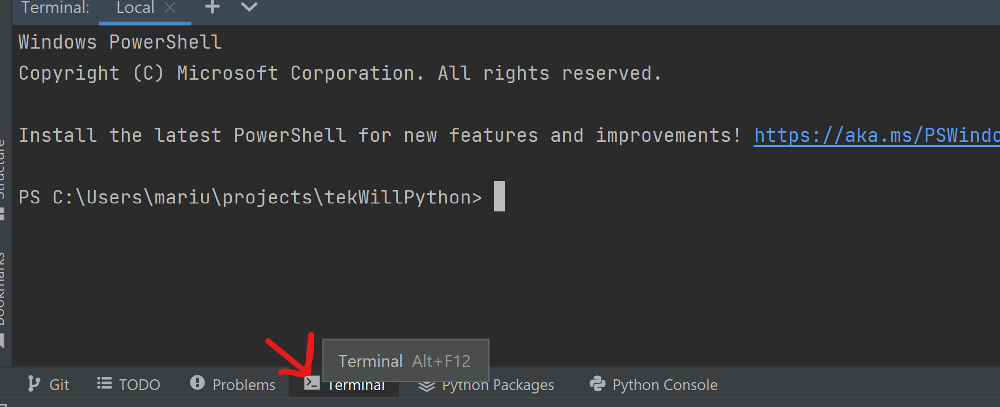
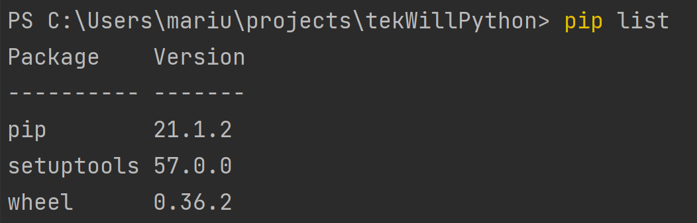
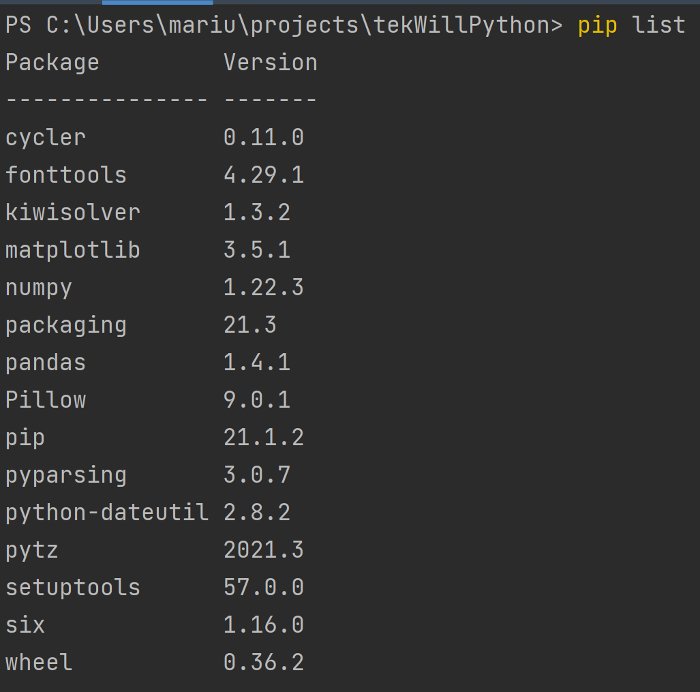
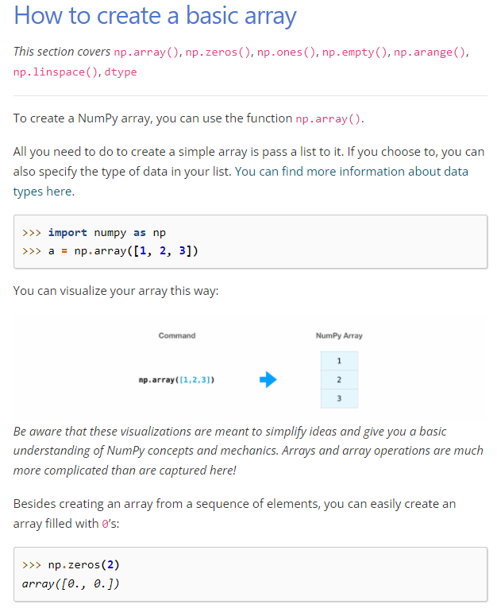
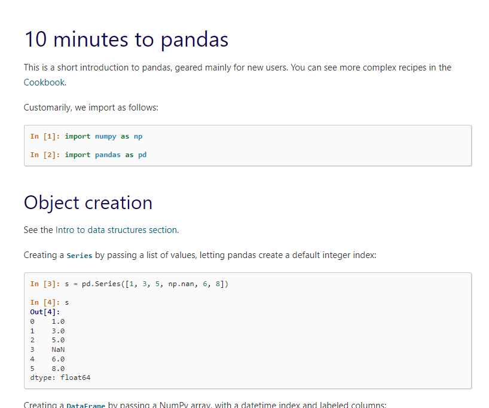
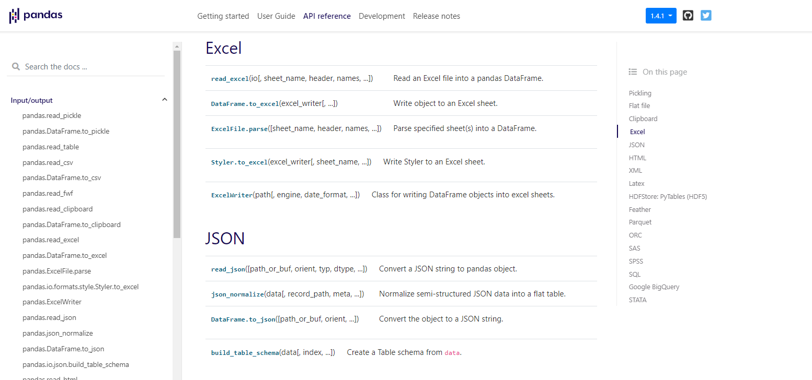
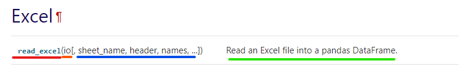
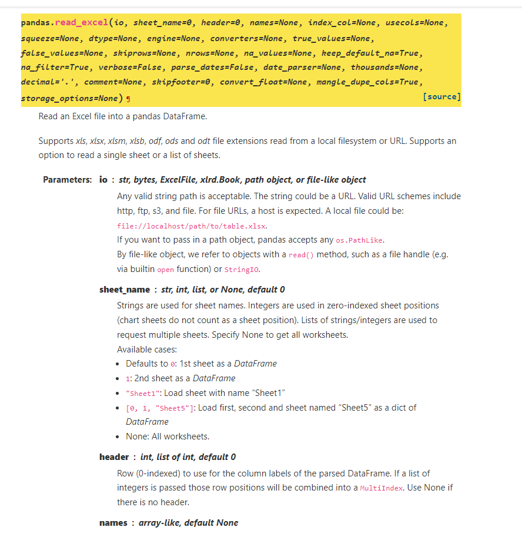
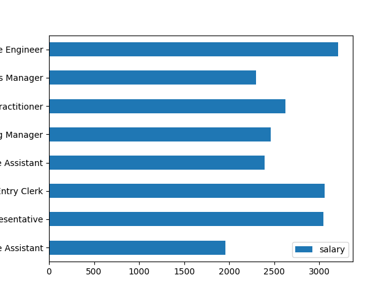

# External Packages

External packages are what makes working with python shine in new colors.

Python provides the ability to easily integrate

## PIP

PIP is the package installer, that is connected to an online repository and has access to most publicly available python
packages.

PIP is also responsible for managing local packages and their installations.

PIP is available through the terminal.

To access PIP, open a new terminal window in PyCharm.



### pip list

`pip list` is the command that shows all currently installed packages.



By default, a normal python project will have the following packages:

pip - pip itself, no need to explain

setuptools and wheel - those 2 packages are packages that are used by pip to install new packages into our virtualenv.

### pip install

`pip install` is the command that allows us to install new packages

It takes the package name as an argument, and will automatically find and install the necessary version of the package.

For example, let's start by downloading 4 libraries.

`pip install pandas, numpy, matplotlib, pydash`.

### Dependencies

After installing the following packages, we will see that there are also a lot of other packages being installed.

These additional packages are called dependencies, they are packages that are installed automatically together with
other external packages, and that are required for their operation.

If we check the list of packages we have after we installed the 3 packages, we will see much more than that.



That's because in addition to the 3 packages we installed, pip installed all the packages that are necessary for those 3
packages to run.

Without them, our packages may not work properly or not work at all.

## Pip freeze

`pip freeze` is a function that will output a list with all the packages inside your virtual-environment.

Similar to `pip list` it will show all the packages with its versions. However, this data is formatted in a "
machine-readable way".

This means that we can create a file with the output of the `pip freeze` command to generate a requirements file.

A requirements file is a file that will contain all our packages, and that can be easily installed using pip.

`pip freeze > requirements.txt` - Will save all packages into the requirements.txt file

We can later use `pip install -r requirements.txt` to install all the packages listed in that file.

This is useful when working in a collaborative environment. Because packages are stored locally in your
virtual environment, when you share your project, the external packages will not be available.

The requirements.txt file will ensure that whoever gets to work or test your project has all the necessary packages to
be able to start your application.

## Using external packages

Using external packages often requires learning.

We, as developers are required to read the documentation of the said package, and analyze ways to use the functionality
provided by the packages.

Documentation is easily found online, if you search for it on google.

Examples:

[Pandas Documentation](https://pandas.pydata.org/docs/)

[MatPlotLib Documentation](https://matplotlib.org/3.5.1/)

[NumPy Documentation](https://numpy.org/doc/)

[PyDash Documentation](https://pydash.readthedocs.io/en/latest/quickstart.html)

The documentation for packages varies, based on the size of the community working on those projects, but usually it's
easy to find a "Quick start guide" or a description on how to use the package, if you look online.

Understanding the correct ways to use a package is very important, and learning about the capabilities of an external
package before installing it, is also helpful, as it may not do what you are looking for.

## Understanding documentation

Most of the packages on pip come with documentation.

That documentation is usually provided on the libraries websites, and those can have various forms.

Most of the time there is a "quickstart guide".

## Quickstart guides

The quickstart tells us how to install, configure and use the
library. [Example numpy](https://numpy.org/doc/1.22/user/absolute_beginners.html)

The quickstart guide will often show example of usages, and ways to work with that library. Most of the time those are
accompanied by code that you can run to test the functionality yourself.

Example from Numpy Documentation.



Examle from Pandas Documentation.



## API references

Besides, containing information describing functionality, a lot of popular packages have a so-called API Reference.

The API Reference contains (or should contain) a description of all the functions and methods available to the user.



API References usually contain long lists describing each function.

Those functions are often shortly explained, and provide an overview of the functions arguments, and what the function
does, or what it returns.

Example: Pandas read_excel function



Red: Function name

Orange: Required arguments

Blue: (Also inside the square brackets []) Optional arguments

Green: Explanation of the function

#### Going deeper

Going deeper into the API References, we can find concrete information on a function we are interested in.

If we take for example the read_excel function, we can have a very detailed list of all the arguments it can take, and
what each argument should represent.



Here we can see what exactly are all the supported arguments, and their default values. We can also get a look at ways
we can pass the arguments, because some functions may take different types of values for the same argument.

I know sometimes it may seem like a lot of information, but usually when you go into

## That's mostly all you need to know

Go around and try the libraries out, try to make something useful, or just toy around to see how it works and why it
does what it does.

## Example usages

### Pandas

Let's try to convert this JSON of [employee_list](prep/employee_list.json) to an excel file.

Note: openpyxl package needs to be installed: Use `pip install openpyxl` in a terminal window inside your project.

```python
import pandas as pd

employee_data_frame = pd.read_json('employee_list.json')
sorted_data_frame = employee_data_frame.sort_values(by='salary')
sorted_data_frame.to_excel('employee_list.xlsx', sheet_name='Employees')
```

The reverse cand also be achieved in the following way.

```python
import pandas as pd

employee_data_frame = pd.read_excel('employee_list.xlsx', sheet_name='Employees')
sorted_data_frame = employee_data_frame.sort_values(by='salary')
employee_data = employee_data_frame.to_json(orient='records')
print(employee_data)
```

The same way, we can convert this data to a dictionary

```python
import pandas as pd

employee_data_frame = pd.read_excel('employee_list.xlsx', sheet_name='Employees')
sorted_data_frame = employee_data_frame.sort_values(by='salary')
employee_data = employee_data_frame.to_dict(orient='records')
print(employee_data)
```

Notice the **orient** argument. It's the argument that tells pandas how to process the information during conversion.

Determines the type of the values of the dictionary.

‘dict’ (default) : dict like {column -> {index -> value}}

‘list’ : dict like {column -> [values]}

‘series’ : dict like {column -> Series(values)}

‘split’ : dict like {‘index’ -> [index], ‘columns’ -> [columns], ‘data’ -> [values]}

‘tight’ : dict like {‘index’ -> [index], ‘columns’ -> [columns], ‘data’ -> [values], ‘index_names’ -> [index.names],
‘column_names’ -> [column.names]}

‘records’ : list like [{column -> value}, … , {column -> value}]

‘index’ : dict like {index -> {column -> value}}

Abbreviations are allowed. s indicates series and sp indicates split.

### Using pandas to get insights into data

We can use pandas to get insight into information from our data.

For example, below I can get the minimum salary, and the employee name of the employee with that salary.

Or I can get the list of positions, alongside the amount of employees on that position.

````python
import pandas as pd

employee_data_frame = pd.read_json('employee_list.json')
sorted_data_frame = employee_data_frame.sort_values(by='salary')
# Getting only the salaries column data
salaries = sorted_data_frame['salary']
# Getting only the positions column data
positions = sorted_data_frame['position']
print("Min salary", salaries.min())
# Min salary 1005
print("Min salary employee", sorted_data_frame.loc[salaries.idxmin(), 'name'])
# Min salary employee Brandy York
print("Min salary", salaries.max())
# Min salary 3987
print("Min salary employee", sorted_data_frame.loc[salaries.idxmax(), 'name'])
# Min salary employee Adrian Powell

print(positions.value_counts())
# Nurse Practitioner                 9
# Sales Manager                      9
# Data Entry Clerk                   8
# Administrative Assistant           7
# Executive Assistant                7
# Customer Service Representative    4
# Marketing Manager                  3
# Software Engineer                  3
# Name: position, dtype: int64

print("Least common positions", positions.value_counts().idxmin(), positions.value_counts().min())
# Least common positions Marketing Manager 3
print("Most common positions", positions.value_counts().idxmax(), positions.value_counts().max())
# Most common positions Nurse Practitioner 9
````

**min** or **max** when applied to a column will return just the minimum value

**idxmin** or **idxmax** will return the index of the element with the min or max value.

`dataframe.loc` allows us to find an item in our dataframe by providing the index and the column to look for.

### Using matplotlib to display graphs of our data

````python
import pandas as pd
import matplotlib.pyplot as plt

employee_data_frame = pd.read_json('employee_list.json')
gropued_by_position = employee_data_frame.groupby(['position'])
average_by_position = gropued_by_position.mean()  # Average per position
print(average_by_position)
# Administrative Assistant         1961.0
# Customer Service Representative  3045.0
# Data Entry Clerk                 3060.0
# Executive Assistant              2395.0
# Marketing Manager                2459.0
# Nurse Practitioner               2624.0
# Sales Manager                    2300.0
# Software Engineer                3212.0
average_by_position.plot(kind='barh')
plt.savefig('example.png')  # Creates figure of the data represented in a bar chart
# plt calls only refer to the latest plotted data
````

The code above creates the following output:



## Pydash

Pydash is a great library that makes our work as developers easier

Let's look at an example.

Let's say you have a dict like this one below.

In order to access the first name we would need to use a very long path.

````python
example = {'employee': {'data': {'personal_data': {'first_name': 'Marius'}}}}

first_name = example['employee']['data']['personal_data']['first_name']
````

This is not only cumbersome, but also may result in problems, for example, if the employee doesn't have a given
property.

Pydash makes our lives easier by giving us a quick way to access such things.

```python
import pydash

example = {'employee': {'data': {'personal_data': {'first_name': 'Marius'}}}}
first_name = pydash.get(example, 'employee.data.personal_data.first_name')
```

Pydash also allows us to provide a default value in case the one at the desired path is not found

````python
import pydash

example = {'employee': {'data': {'personal_data': {'first_name': 'Marius'}}}}
first_name = pydash.get(example, 'employee.data.personal_data.first_name')
print(first_name)
# Marius

# Using get with a default
last_name = pydash.get(example, 'employee.data.personal_data.last_name', 'No last name')
print(last_name)
# No last name
````

Similar to the get method, we can do the same using the set methods from pydash.

```python
import pydash

example = dict()

pydash.set_(example, 'employee.data.personal_data.full_name', 'Marius Tricolici')

print(example)
# {'employee': {'data': {'personal_data': {'full_name': 'Marius Tricolici'}}}}
```

Other examples of functionalities

```python
import pydash

pydash.flatten([1, 2, [3, [4, 5, [6, 7]]]])  # Flattens the a list of lists
# [1, 2, 3, [4, 5, [6, 7]]]


pydash.flatten_deep([1, 2, [3, [4, 5, [6, 7]]]])  # Flattens an list of lists until no lists are inside the list
# [1, 2, 3, 4, 5, 6, 7]

pydash.omit({'name': 'moe', 'age': 40}, 'age')  # Returns a new dict omitting a key
# {'name': 'moe'}

pydash.times(3, lambda index: index)  # Perform a function multiple times, return all results
# [0, 1, 2]

pydash.map_([{'name': 'moe', 'age': 40}, {'name': 'larry', 'age': 50}],
            'name')  # Return a list of values with the property from a list of dicts/objects
# ['moe', 'larry']

```

## Numpy

Numpy is a library that can handle a lot of array processing.

An array is a list-like structure, where each element can be accessed by an index.

For example, **arange** will create an array from a range.

Numpy allso allows us to **reshape** arrays, in the example below we **reshape** a 1 dimensional array into a 2
dimensional array containing 3 lists, 5 items each.

````python
import numpy as np

a = np.arange(15).reshape(3, 5)
print(a)
# [[ 0  1  2  3  4]
#  [ 5  6  7  8  9]
#  [10 11 12 13 14]]
````

It also provides a lot of useful operations that can be done with said arrays. Addition, subtraction, multiplication and
much more.

```python
import numpy as np

a = np.array([20, 30, 40, 50])
b = np.arange(4)
print(b)
# [0, 1, 2, 3]
c = a - b
print(c)
# [20, 29, 38, 47]
print(b ** 2)
# [0, 1, 4, 9]
print(10 * np.sin(a))
# [9.12945251, -9.88031624, 7.4511316, -2.62374854]
print(a < 35)
# [True, True, False, False]
```

NumPy is a niche library for concrete operations on datasets of items.

NumPy is also a very well optimized library, meaning that it's operations are going to be executed very fast.