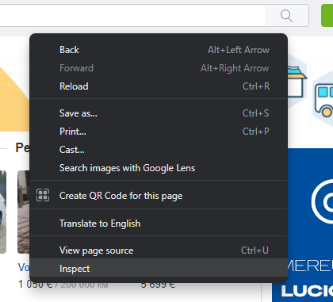
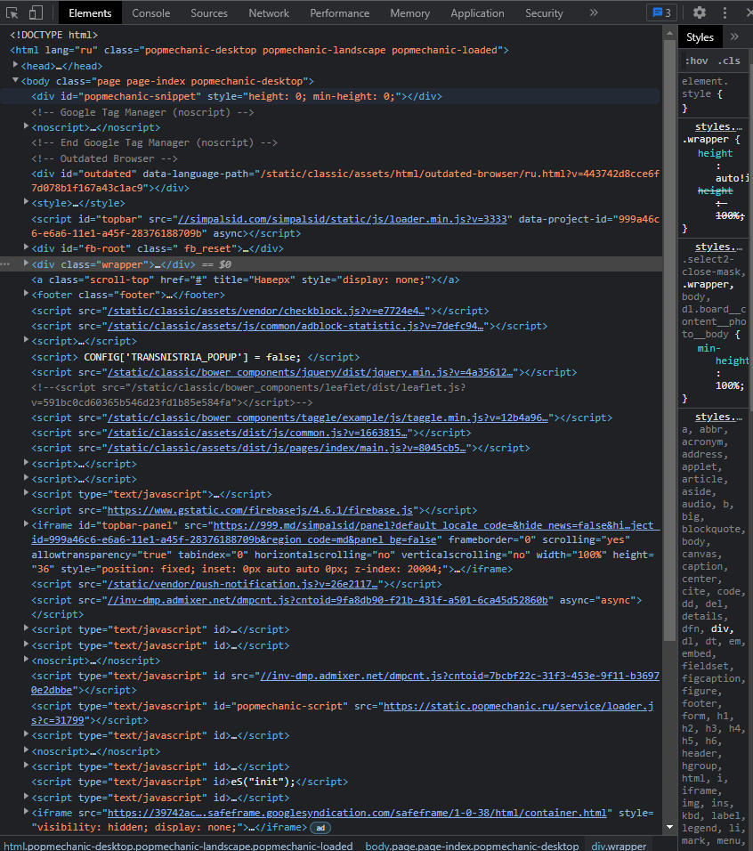
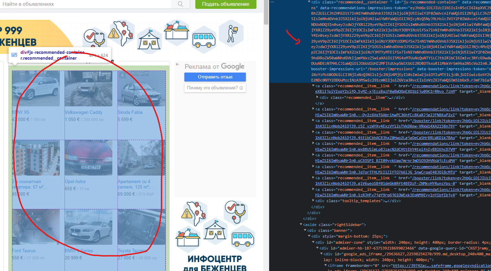
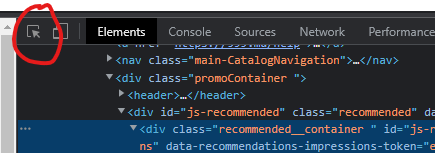

# WEB Again

Last time, we tried to understand how the internet works, how elements within the network communicate and how the
biggest part of the internet, the HTTP web works.

Today we are going to learn about techniques of working with the web.

## Web Scraping

Web scraping is the process of Extracting information from websites that don't provide an API.

Scraping is usually done by a process where a computer program emulates a web browser (acts as a browser) and accesses
the HTML data from the page.

First, we need to understand how HTML Works.

## HTML

HTML form of a document which is structured in blocks.

Each block is in itself an element which can contain other elements.

HTML Elements are described inside the element tags, in between the following signs <tag>. Most elements also have a
closing tag </tag>, ending tags have a slash before the tag name. In between the opening and the closing tags is the
body of the element.

Inside an element we can have text, or other elements

Example: `<body>Content inside the body</body>`

### Common HTML tags

* `<html></html>` - main html tag - everything inside a html page is contained inside a html tag
* `<head>header of a page</head>` - header - used to contain meta information about the page
    * Meta information is information that is useful for the browser to load information, but is usually not shown to
      users on the web page
    * These include imports of styles and scripts that will have to run on the web server
* `<body>Body of the page</body>` - body - used to signify the main content of the webpage
* `<p>paragraph</p>` - paragraph - used for representing textual information
* `<h1>Heading</h1>` - headings - used to represent textual headings in an HTML document (like heading is a Word
  document)
    * `<h2>Smaller Heading</h2>` - smaller heading
    * `<h3>Even Smaller Heading</h3>` - even smaller heading
    * you get the idea :) The bigger the number, the smaller the heading, `h6` is the smallest type of heading
* `<a>Link</a>` - link - used to represent links to other resources
    * The link to the resource is available as an attribute
    * `<a href='http://google.com'>Link to google</a>`
* `` - images - images don't have a closing tag
    * `` - the soruce for the image is specified in the src attribute
* `<div></div>` - blocks - blocks that usually contain all sort of different elements, divs are used for styling and
  structuring a page

### HTML Attributes

Modern HTML Pages are very complex, and each element has a lot of attributes attached to it.

Attributes on an element are used to modify its properties or just have symbolical meanings.

We already saw some attributes above like `src` and `href`, but the important attributes for us on a html element
are `id` and `class`.

The `id` attribute is a unique attribute that may or may not be present on an element, and it is used to identify that
specific element in a page.

The `class` attribute is used to find a group of elements with similar properties.

### Example HTML Page

Gathering all the data together, we can make a very basic HTML page, just to demonstrate a simple way one may be
constructed.

````html

<html lang="en">
<body>
<h1 id="welcome-message">Welcome to my page</h1>
<div class="main-info">
    <p>Hey everyone, thanks for visiting my page</p>
    <p>My page is very empty, so you better go to <a href="https://google.com">this page</a></p>
    <p>By the way, here's an image of a cat</p>
    
</div>
</body>
</html>
````

If you save the code above in a file with the extension .html, you can open it in your browser, and it will show as a
web page.

Now what happened above.

We created an HTML web page.

Inside the body of that web page, we have added a heading with a welcome message.

We've also created a block which contains a couple of paragraphs.

Inside the paragraph we have also included a link to another website.

Last, we have added an image of a cat

This is a very simple website, modern websites are far more complex.

## Beautiful Soup

Now that we understand how websites are constructed (a short version at least), we can try to dig deeper into some
bigger websites.

Beautiful Soup is a library that parses websites, and groups the information into easily accessible elements.

`pip install beautifulsoup4`

Beautiful soup allows us to quickly find information within an HTML page.

Let's try to work with our previous example on this.

````python
from bs4 import BeautifulSoup

html_code = """
<html lang="en">
<body>
<h1 id="welcome-message">Welcome to my page</h1>
<div class="main-info">
    <p>Hey everyone, thanks for visiting my page</p>
    <p>My page is very empty, so you better go to <a href="https://google.com">this page</a></p>
    <p>By the way, here's an image of a cat</p>
    
</div>
</body>
</html>"""

soup = BeautifulSoup(html_code)
print(soup.find('img'))  # Finds the first image
# 
print(soup.find('img').get('src'))
# https://i.imgur.com/qZImY9j.jpg # The source of the image, we can download it from this
paragraphs = soup.find_all('p')  # Finds all paragraphs
for paragraph in paragraphs:
    print(paragraph.text)  # Printing just the text inside the paragraphs
# Hey everyone, thanks for visiting my page
# My page is very empty, so you better go to this page
# By the way, here's an image of a cat
````

## Inspecting the website

Inspecting websites is the process of getting the information about the layout, and elements of a webpage.

WebPages can be inspected in your browser using the inspect functionality of your browser.



**Right-click** anywhere in a webpage to bring up this menu, and then click inspect.

This will bring up a window that will look similar to this.



Inside here you have access to all the code inside the HTML of the webpage.

By hovering on an element, your browser will automatically highlight the element that's being hovered on.



You can also do the reverse process using the highlight option. That lets you select anything on a page to see it in the
inspect view.



Don't be afraid to change, modify, open and close whatever you think you want. The odds that you break anything avre
very small :).

## More examples

As you can see, in the example above, beautifulsoup gives us the ability to find and extract information from a website,
but it also requires us to have some understanding about how a HTML page is structured.

Let's take on a more complicated example, extracting info from wikipedia.

````python
import requests
from bs4 import BeautifulSoup

response = requests.get('https://ro.wikipedia.org/wiki/Republica_Moldova')

soup = BeautifulSoup(response.content)

article_content = soup.find("div", {"id": "mw-content-text"})
inner_article_items = article_content.find("div", {"class": "mw-parser-output"}).find_all("p")
all_article_text = [item.text for item in inner_article_items]
print(all_article_text)
# A lot of text
all_images = soup.find_all('img')
all_images_sources = [img.get('src') for img in all_images]
print(all_images_sources)
# A lot of images
````

As you can see, navigating any website is done in a relatively similar way, we search for the block of HTML we are
interested in, and we process it.

In general, you can regard the webpages as a dict of dicts of dicts... Where each element (each block) can have a lot of
other blocks inside it.

Web scraping requires a lot of work (manual work), and relies heavily on how easy the webpage is to read (for the
computer).

We can find in the HTML code of a web page some ID's / classes or other properties we can use to find exactly the item
we are looking for.

````python
from bs4 import BeautifulSoup
import requests

prive_value_class = "adPage__content__price-feature__prices__price__value"
price_currency_class = "adPage__content__price-feature__prices__price__currency"

url = input('Enter 999 url to find price')
data = requests.get(url)
soup = BeautifulSoup(data.content)

price = float(soup.find('span', {"class": prive_value_class}).text.strip().replace(' ', ''))
currrency = soup.find('span', {"class": price_currency_class}).text.strip()
print(f'Price is {price} {currrency}')
````

This is why web scraping is a "labour intensive" task. It requires you to research the best way to extract the data you
need from a website.

Web scrapers are developed individually for a website (sometimes even for a language version of a website), and require
doing this kind of processing for each access of the page.

Bonus:

Enter deal of the day scrapper.

```python
from bs4 import BeautifulSoup
import requests
import pandas

data = requests.get('https://enter.online/')
soup = BeautifulSoup(data.content)

deals_of_the_day = soup.find('div', {"class": "deal-of-the-day-slider"})
deals_list = deals_of_the_day.find('ul', {"class": "uk-slider-items"}).find_all('li')
deals = []
for deal in deals_list:
    data = dict(
        product=deal.find('span', {"class": 'product-title'}).text.strip(),
        new_price=deal.find('span', {"class": 'price-new'}).text.strip(),
        old_price=deal.find('span', {"class": 'price-old'}).text.strip(),
        discount=deal.find('span', {"class": 'discount'}).text.strip(),
    )
    data_clean = dict(
        product=data['product'],
        new_price=data['new_price'].replace(' ', ''),
        old_price=data['old_price'].replace(' ', ''),
        discount=data['discount'].replace(' ', ''),
    )
    deals.append(data_clean)
deals_df = pandas.DataFrame(deals)
print(deals_df)
```

And another one:

Scraping the list of products for a search query

```python
from bs4 import BeautifulSoup
import requests
import urllib.parse as parse
import pandas

base_url = 'https://enter.online/search?query={}'

search_term = input('Product to search')

search_url = base_url.format(parse.quote(search_term))  # Setting the search term in the url

data = requests.get(search_url)
soup = BeautifulSoup(data.content)

product_list = soup.find('div', {'class': "product-list"})
products = product_list.find_all('div', {"class": "grid-item"})
results = []
classes_to_look_up = ['product-title',
                      'product-descr',
                      'price',
                      'price-new',
                      'price-old',
                      'discount', ]
for deal in products:
    data = dict()
    for _class in classes_to_look_up:
        try:
            data[_class] = deal.find('span', {"class": _class}).text.strip()
        except:
            data[_class] = None
    results.append(data)
dataFrame = pandas.DataFrame(results)
print(dataFrame)
```

In the example below, we use code to modify the url (the search query parameter) as we see fit. This is also why
understanding URLs and their parameters is important in web scraping.

## Simulating browsers

Accessing information from a website is fun, but what is more fun, is interacting with those websites.

There are many tools that allow programmers to emulate a browser and emulate actions on those browsers programmatically.

The one we are going to take a look at today is called Selenium

`pip install selenium`.

Selenium is a WebDriver, a program that is able to interface between a programming language, and a website.

It is mostly used for testing websites and web pages. But we can use it to automate things.

### The emulated browser

The emulated browser inside selenium acts like a normal browser, and selenium provides multiple options for them as
well.

These emulated browsers give us the ability to press buttons, fill in input fields, and much more.

### Setting up

First, you will need to download a driver (webdriver)

The downloaded file should be kept somewhere in your project. You cand download it
from [here](https://chromedriver.chromium.org/home). Please note that your driver version must be the same as your
installed Chrome version.

Don't use chrome ? Don't worry, there are other drivers, for all browsers. Check the
information [here](https://www.selenium.dev/documentation/webdriver/getting_started/install_drivers/)

```python
from selenium import webdriver

driver = webdriver.Chrome()

driver.get("http://google.com")

driver.quit()
```

The code above will open a new chrome window, and will close it.

We can do more than that.

```python
from selenium import webdriver
from selenium.webdriver import Keys
from selenium.webdriver.common.by import By

driver = webdriver.Chrome()

driver.get("http://google.com")

element = driver.find_element(By.TAG_NAME, 'input')  # Finding the search input field
element.send_keys('Python')  # Typing Python in the input field
element.send_keys(Keys.RETURN)  # Pressing enter

driver.quit()
```

We can also use it in combination with beautifulsoup

```python
from selenium import webdriver
from selenium.webdriver import Keys
from selenium.webdriver.common.by import By

driver = webdriver.Chrome()

driver.get("http://google.com")

element = driver.find_element(By.TAG_NAME, 'input')  # Finding the search input field
element.send_keys('Python')  # Typing Python in the input field
element.send_keys(Keys.RETURN)  # Pressing enter
images_link = driver.find_element_by_link_text("Mai multe imagini")  # Finding More images link
images_link.click()  # Clicking the link button

from bs4 import BeautifulSoup

soup = BeautifulSoup(driver.page_source)  # accessing the HTML of the page
print([a.get('src') for a in soup.find_all('img')])
driver.quit()
```

There are almost endless possibilities. Opening new windows, interacting with buttons, checking if something is found,
for example Success message.

Other examples will be provided during the class.


