# Web services

Up until now, we've learned to work with the web, and process information we get from the web.

Today we are going to learn how to create our own web services (web applications), how to configure them and how to
process requests.

## What is a web server

A web server, is a program that processes HTTP requests from a client, and finds the resource that the client requests.

We have learned that web servers return resources, most of those resources are HTML, XML or JSON.

Web servers are capable of returning both files for existing resources, or data generated by a program. We are going to
focus on the latter.

### Don't reinvent the wheel

Although it would be possible to create a web-server from ground up, it is very unnecessary. Today there are many web
server applications that have the responsibility of managing network traffic and making sure that the request gets to
the right place, as well as the response gets to its destination.

Commonly used web servers include Apache, Nginx, Apache Tomcat, lighttpd, Microsoft ISS, and many more. All of these
examples are used by millions of companies across multiple applications. Each of them has its own way of dealing with
things, but the function is generally the same.

### Function of a web server

The function of a web server is to wait for requests, and once a request has been received, to figure out a way it can
be processed.

Web servers usually listen on a specific port of a computer, thus it has both an IP and a port, and then they process
all the HTTP requests that come on that port.

Every time an HTTP request is received, the web server tries does its best to figure out what should happen for the
requested URL.

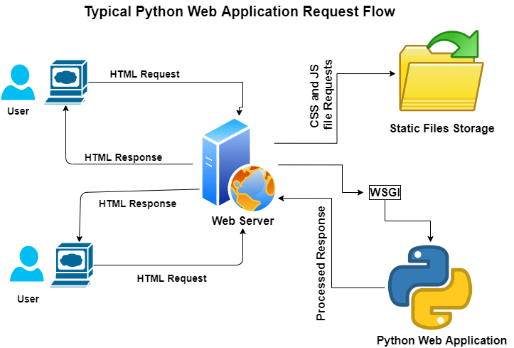

This can go 3 ways:

1. Request is for a static element (a file on the web server) - The static file is returned
2. Request is for a web application (an API) - The web application is called to provide the result
3. Request can't be fulfilled by this webserver (no file or application configured for the requested URL) - An error is
   returned (Example: 404 Not Found)

We are going to focus on the second version

## Web applications

A web application is an application designed to receive HTTP requests from a web server and fulfill them. Similar to how
a Web server works.

A Web Application can be programmed to call different functions based on the URL that's being accessed.

Think of it as calling a function in your program but instead of using a function call, the web application does it for
you.

Communication between the web-server and web-application in Python is done using WSGI.

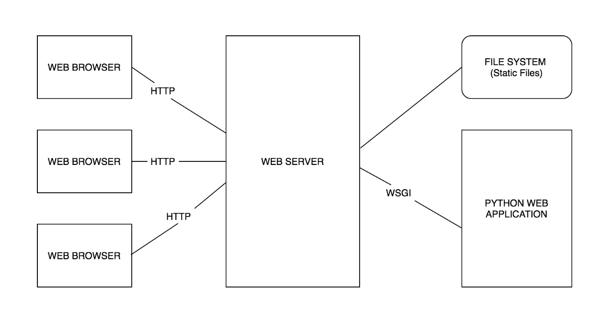

But how does a web application know what function we should call ? And how can I tell it what functions it is allowed to
call ? (See below)

## Web frameworks

A framework is a pre-packaged collection of tools and libraries that solves common development solutions. For example,
creating web applications.

Web frameworks include all the necessary tools we might need to be able to quickly and easily start developing
functionality, rather than worry about setting up managing the entire infrastructure.

Using a framework is essentially the same as using a library, you read some documentation, you watch some tutorials, and
you get something done.

The difference between a library and a framework, is that a framework does a lot in the background, with code that we
don't usually see.

They also have a "starting point", if before this we created a "main.py" file just because we wanted to, when we work
with frameworks, they usually require such a file to start up the web application.

## Flask

[Flask](https://flask.palletsprojects.com/en/2.0.x/) is an open-source python library that is used for creating web
applications.

Flask allows us to easily define resources in a web application, and can be run locally (without a web server) to test
our examples.

To get started with flask, install the flask package from pip `pip install flask`, or using the Python Packages manager
in PyCharm.

I would recommend that you use a new project for this, so we don't have any conflicts.

We would need to create a new file, called `app.py`

Inside your `app.py` we would need to define the following code

```python
from flask import Flask

app = Flask(__name__)


@app.router('/')
def main_page():
    return '<h1>Welcome to my page</h1>'
```

### Starting the app

You can now start this application using 2 ways:

1. Terminal (quick)

Inside the terminal type flask run (the terminal path should be where your app.py file is)

You should see something like this

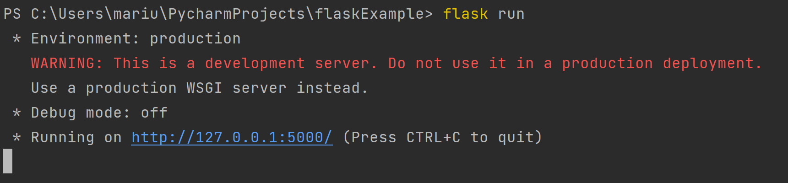

2. Configure PyCharm to run Flask Application

Edit run configurations

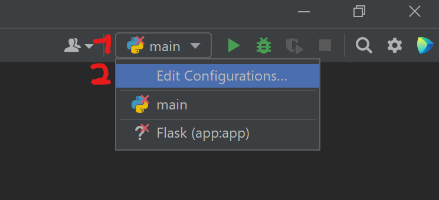

Add a new run configuration

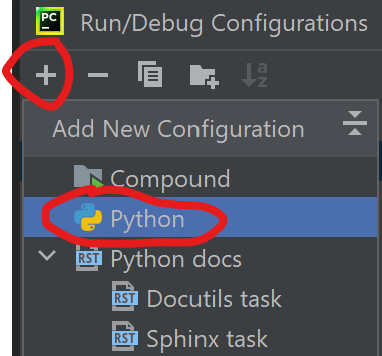

Configure the said configuration

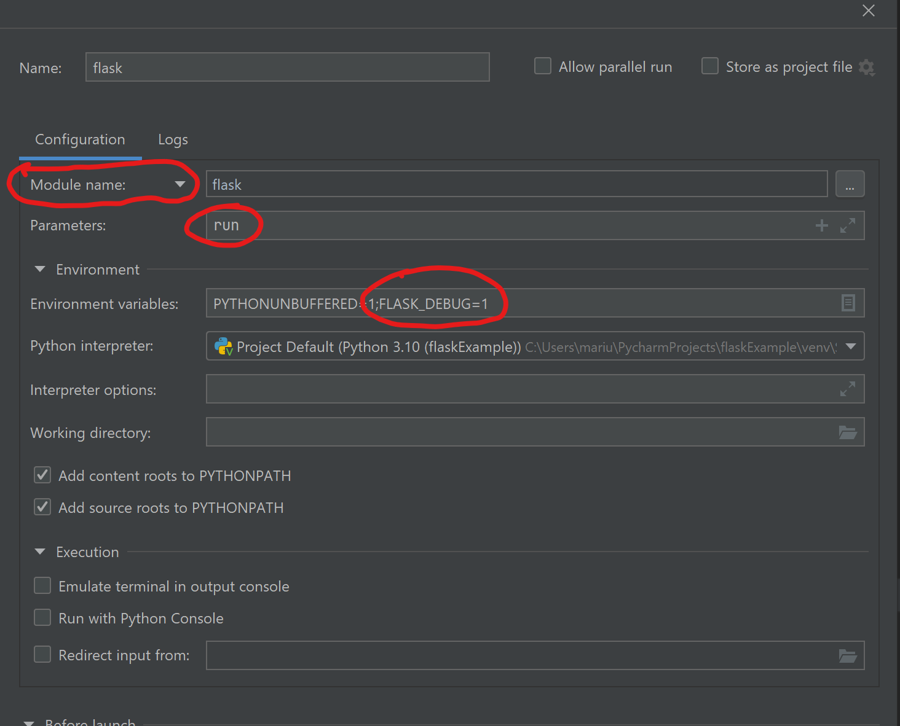

* Configure for module name instead of script path
* Type in flask into the module field
* Type the run command into the parameters

You can run the app like so:

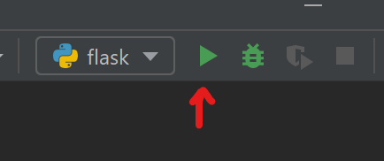

And should see output like below:

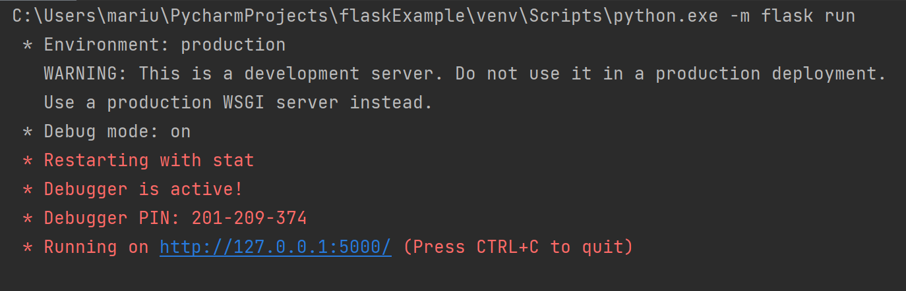

## Accessing the app

You can access the application using the provided link. If you followed the example above, you should see something like
in the example below.

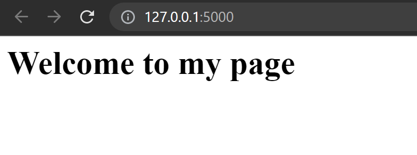

**Congratulations, you have configured your first web application**

## Flask functionality

Flask is able to process all types of request methods (GET, POST, etc..), inside flask we have access to the request
made by the client and can send a response for the following requests.

```python
some_random_list = [
    dict(name='Element 1'),
    dict(name='Element 2'),
    dict(name='Element 3'),
]


@app.route('/element/data')
def get_list_data():
    return jsonify(some_random_list)
```

We can access this by `http://127.0.0.1:5000/element/data` and we will see a response similar to this:

```
[
  {
    "name": "Element 1"
  }, 
  {
    "name": "Element 2"
  }, 
  {
    "name": "Element 3"
  }
]
```

**jsonfiy** is a flask method that transforms objects into a JSON response.

### Break down

Let's break down what happens above.

Firstly, we describe a new route for our web app.

A route is a path inside our web application that can be accessed using the url.

The route defines "what should be accessed inside our web application for the function to be called". This is also known
as an **endpoint**. An endpoint is regarded as the "destination" for our request.

Each route is decorating a python function.

That python function can return either HTML (default) or JSON Data, or even files.

If an exception happens inside the function, the application will create an error response, but will continue to run.

Example:

````python
@app.route('/exception')
def get_exception():
    raise Exception('Intentional Exception')
    return jsonify([])
````

We received an exception:

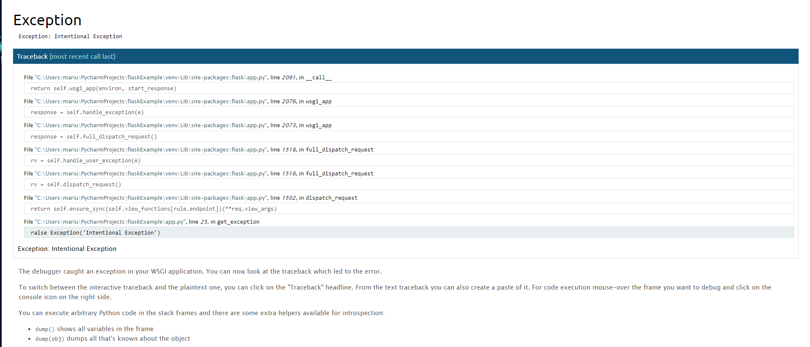

The app continues to run

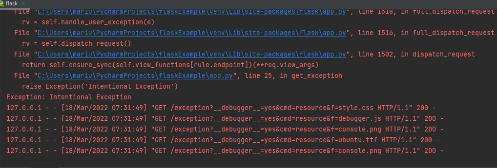

## The route

The route should be a valid URL location.

When defining routes it is good to think about the structure of the web application.

For example, having a web application that allows to book tickets, you can have two options.

1.
    * `/tickets/available/list` - List all tickets
    * `/tickets/buy` - Buy a ticket
    * `/bookings/list` - List bookings
    * `/bookings/add` - Add booking
    * `/bookings/delete` - Delete booking

2.
    * `/list-available-tickets` - List all tickets
    * `/buy-ticket` - Buy a ticket
    * `/list-bookings` - List bookings
    * `/add-booking` - Add booking
    * `/delete-booking` - Delete booking

Both of the above examples are valid examples, and will work, but in terms of structure, the first example is more 'web
friendly' than the second one. Thus, although functionally they are both the same, structurally they are very different,
as the second one has no structure at all.

## The request object

Inside our route handler (the function responsible for a route) we have access to a request object.

**Note**: The request should be imported ``from flask import request``

That request object contains all the information about the current request.

````python
from flask import request


@app.route('/example')
def get_example():
    print(request.data)
    print(request.args)
    return jsonify([])
````

For example, with this route, we are printing the request data and args. `request.args` refers to the query parameters
of the request, `request.data` is the information from a POST/PUT request.

Given the following request: `http://127.0.0.1:5000/example?param1=1&param2=2`

We will see an output like this:

```
b'' -- this is the request data
ImmutableMultiDict([('param1', '1'), ('param2', '2')]) -- this is a dict with our parameters
```

Using such parameters we can easily make our program dynamic.

For example:

````python
from flask import request


@app.route('/random_number')
def get_random():
    from_nr = int(request.args.get('from'))
    to_nr = int(request.args.get('to'))
    return jsonify(random.randint(from_nr, to_nr))
````

Accessing the URL with these parameters `http://127.0.0.1:5000/random_number?from=1&to=100` returns a random number from
1 to 100.

We can also handle the absence of parameters, for example, if no `from` and `to` are provided, we can use 1 and 10 by
default.

````python
@app.route('/random_number')
def get_random():
    from_nr = int(request.args.get('from', 1))  # Default 1
    to_nr = int(request.args.get('to', 10))  # Default 10
    return jsonify(random.randint(from_nr, to_nr))
````

Now we can access `http://127.0.0.1:5000/random_number` without parameters and still get a result.

## POST Requests

Our routes take by default all request methods, we can customize this by making a route take only POST or GET or both,
explicitly using the `methods` argument of the route decorator.

For this example I created a python module called `something` to save information in our application.

````python
local_list = []


def add_something(anything):
    data = get_something()
    data.append(anything)


def get_something():
    return local_list
````

Now in our app we can have routes like this:

````python
@app.route('/something/add', methods=['POST'])
def only_post():
    from something import add_something
    add_something(request.get_json())
    return ({}, 200)


@app.route('/something/get', methods=['GET'])
def only_get():
    from something import get_something
    return jsonify(get_something())  # Return data


@app.route('/something/', methods=['POST', 'GET'])
def post_and_get():
    if request.method == 'GET':
        from something import get_something
        return jsonify(get_something())
    elif request.method == 'POST':
        from something import add_something
        add_something(request.get_json())
        return ({}, 200)
````

If I try to access a POST only URL with a GET request, I will receive the following error message:

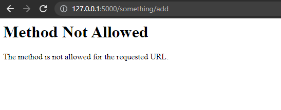

Unfortunately we cannot send POST requests easily from our browser, but we can use python.

```python
import json

import requests

response = requests.post(
    'http://127.0.0.1:5000/something/add',
    data=json.dumps({'item': 'something item'}),
    headers={'Content-type': 'application/json'}
)
print(response.status_code)  # 200

response = requests.get(
    'http://127.0.0.1:5000/something/get'
)
print(response.content)  # b'[\n  {\n    "item": "something item"\n  }\n]\n'
```

Note that we need to tell the request that the content type is JSON, flask doesn't process data using `get_json()` if
the content type is not `application/json`.

We can use our combined endpoint to do both get and post requests

```python
import json

import requests

response = requests.post(
    'http://127.0.0.1:5000/something',
    data=json.dumps({'item': 'something item'}),
    headers={'Content-type': 'application/json'}
)
print(response.status_code)  # 200

response = requests.get(
    'http://127.0.0.1:5000/something'
)
print(response.content)  # b'[\n  {\n    "item": "something item"\n  }\n]\n'
```

## Sending custom responses

As mentioned before, we can send files, json or html code as a response.

By default, flask will respond with whatever the function returns.

We can pass tuples as a return value to signify one of the following.

```python
# The data alone, status is automatically 200
return response_body
# A tuple of 2 elements, first is data, second is numeric value for status (example 200)
return (response_body, response_status)
# A tuple of 2 elements, first is data, second is a dict for headers, status is automatically 200
return (response_body, response_headers)
# A tuple of data, status and headers
return (response_body, response_status, response_headers)  
```

This allows us to modify the structure of our response, in an easy way

Given the following example route:

```python
@app.route('/response-example')
def return_response():
    a = random.randint(1, 4)
    if a == 1:
        return jsonify(a)  # response body
    if a == 2:
        return jsonify(a), 201  # Response body and status
    if a == 3:
        return jsonify(a), 201, {'a-val': a}  # response body, status and header
    if a == 4:
        return jsonify(a), {'a-val': a}  # response body and header
```

We will have the following result:

````python
import requests

for a in range(5):
    response = requests.get(
        'http://127.0.0.1:5000/response-example',
    )
    print(response.status_code)
    print(response.headers)
    print(response.content)
# 201
# {'Content-Type': 'application/json', ...
# b'2\n'
# 200
# {'Content-Type': 'application/json', ...
# b'1\n'
# 201
# {'Content-Type': 'application/json' ... , 'a-val': '3', ...
# b'3\n'
````

## Response objects

We can also create a response object, that we can customize in our function.

````python
from flask import make_response


@app.route('/response-example-2')
def response_example():
    response = make_response({'data': 'some data'})
    response.status = 201
    response.set_cookie('Custom-cookie', 'CookieValue')
    response.headers.set('Custom-header', 'headerValue')
    return response
````

Testing the above endpoint

```python
import requests

response = requests.get(
    'http://127.0.0.1:5000/response-example-2',
)
print(response.status_code)  # 201
print(response.cookies.items())  # [('Custom-cookie', 'CookieValue')]
print(response.content)  # b'{\n  "data": "some data"\n}\n'
print(response.headers)
# {'Content-Type': 'application/json', 'Custom-header': 'headerValue', ...
```

## Redirects

In flask (as with many other web app frameworks) we have the ability to redirect our requests to the necessary endpoint.

This can be used when, for example you have both a get and post endpoint merged into one, but you also have separate
endpoints. This can also be used to redirect user to the login page, if they are not authorised.

````python
@app.route('/something', methods=['POST', 'GET'])
def post_and_get():
    if request.method == 'GET':
        return redirect(url_for('only_get'))
    elif request.method == 'POST':
        return redirect(url_for('only_post'), code=307)


@app.route('/something/add', methods=['POST'])
def only_post():
    from something import add_something
    add_something(request.get_json())
    return ({}, 200)


@app.route('/something/get', methods=['GET'])
def only_get():
    from something import get_something
    return jsonify(get_something())  # Return data
````

In the above example, **GET** requests will be redirected to `only_get`, and **POST** requests will be redirected
to `only_post`.

Note that in the redirect for the post example, we used code `307`.

There are 2 redirect codes, **302** and **307**.

As per Web specification, **302** will redirect the client to get the data from the other location (other endpoint), and
it only works for `GET` requests.

Code **307** allows us to redirect while keeping the original request method and parameters.

## Saving views in other files

You can also structure your project by using view in different files and folders.

In order to do this, you need to define a blueprint in the package with your views.

File: _random_views.py_

````python
from app import app
from flask import Blueprint, jsonify
import random

random_views = Blueprint('views', __name__)


@app.routes('/random/number')
def random_randint():
    return jsonify(random.randint(1, 100))


@app.routes('/random/list')
def random_randint():
    lst = []
    for a in range(10):
        lst.append(random.randint(1, 100))
    return jsonify(lst)
````

File: _app.py_

````python
from flask import Flask

app = Flask(__name__)

from random_views import random_views

app.register_blueprint(random_views)  # This registers the views inside the random_views package to the application
````

See example here: [example code](example_multiple_files)

## Sessions

In order to use sessions, your flask app should have a secret key provided.

Without the secret key, accessing the session object will be forbidden.

The sesssion object will keep track of the person who made the requests. This is done by sending additional headers
together with the request.

````python
from flask import Flask, request, session, make_response, jsonify

app = Flask(__name__)
app.secret_key = b'lkj12h4oiu1-9sdaujbfi1u3h813h5913'  # Random secret key


@app.route('/login', methods=['POST'])
def login():
    username = request.get_json().get('username')
    if username:
        session['user'] = username
    return make_response({}, 200)


@app.route('/who-is', methods=['GET'])
def who_is_the_user():
    return jsonify(session.get('user'))

````

Sessions are automatically managed by some web-clients (for example web browser).

We can also manage sessions with python requests using the `Session` object

````python
import json

from requests import Session

# Initialize the session
my_session = Session()

# Requesting from the session
r = my_session.post(
    'http://127.0.0.1:5000/login', data=json.dumps({
        'username': 'Marius'
    }),
    headers={'Content-type': 'application/json'}
)

# Another request from the same session
# The web application remembers us from last time
response = my_session.get('http://127.0.0.1:5000/who-is')
print(response.content)  # Marius
````

See this example [here](sessions_example).

## More examples

See the course assignment project [here](https://github.com/mtricolici98/courseAssignmentLiveCoding)