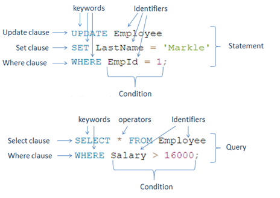
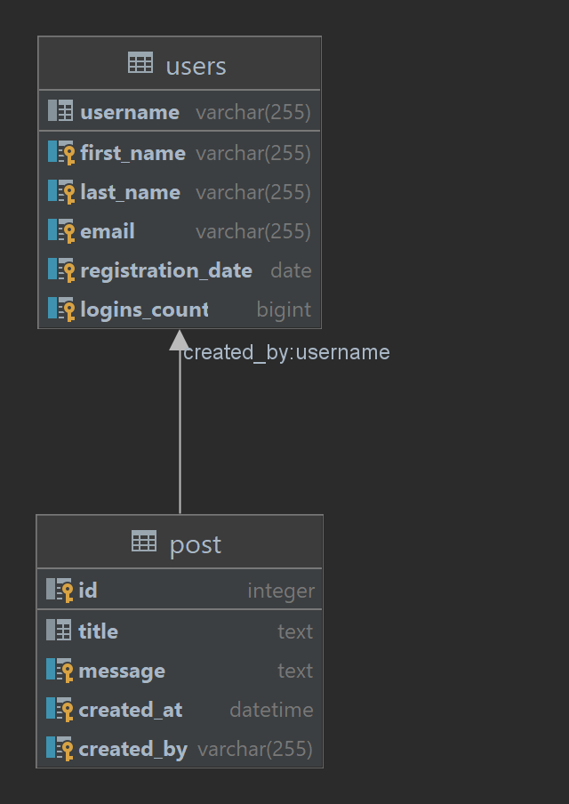
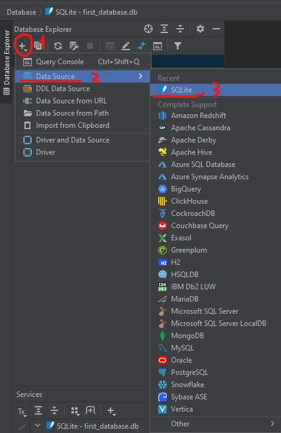
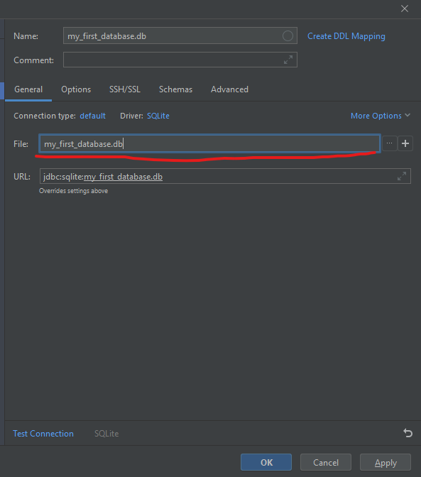
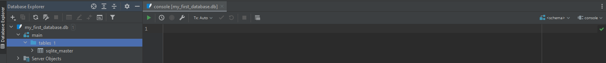
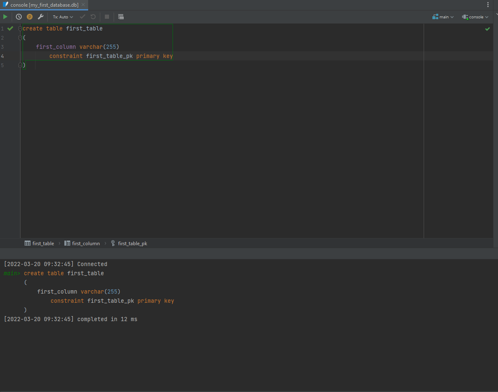

# Databases

## What is a database

A database is an organized collection of structured information, or data, typically stored electronically in a computer
system. This information is usually controlled by a DBMS (Database Management System). Together, the data and the system
that controls it, is regarded as a database system, but in general the term **database** refers to both the data and the
system.

Ex: _The information is stored in a database_ or _The database is starting up_ (the DBMS is starting up)

Data inside a database is often stored in **tables**, represented by Rows and Columns

This data can be then easily accessed, modified, updated and organized using by the DBMS.

Most Databases use SQL (structured query language) for functionality of writing and retrieving data.

### What is SQL ?

What is Structured Query Language (SQL)? SQL is a programming language used by nearly all relational databases to query,
manipulate, and define data, and to provide access control.

We will later learn more about SQL.

### What is the difference between a database and a spreadsheet

Databases and spreadsheets (such as Microsoft Excel) are both convenient ways to store information. The primary
differences between the two are:

* How the data is stored and manipulated
* Who can access the data
* How much data can be stored

Spreadsheets were originally designed for one user, and their characteristics reflect that. They’re great for a single
user or small number of users who don’t need to do a lot of incredibly complicated data manipulation. Databases, on the
other hand, are designed to hold much larger collections of organized information—massive amounts, sometimes. Databases
allow multiple users at the same time to quickly and securely access and query the data using highly complex logic and
language.

### Database software

Database software is used to create, edit, and maintain database files and records, enabling easier file and record
creation, data entry, data editing, updating, and reporting. The software also handles data storage, backup and
reporting, multi-access control, and security. Strong database security is especially important today, as data theft
becomes more frequent. Database software is sometimes also referred to as a “database management system” (DBMS).

A DBMS serves as an interface between the database and its end users or programs, allowing users to retrieve, update,
and manage how the information is organized and optimized. A DBMS also facilitates oversight and control of databases,
enabling a variety of administrative operations such as performance monitoring, tuning, and backup and recovery.

Some examples of popular database software or DBMSs include MySQL, Microsoft Access, Microsoft SQL Server, Oracle
Database and PostgresSQL.

### Database servers

Most of the DBMS require a server that is used to constantly manage and monitor the database. These servers are the "
DBMS" itself, and all the access to the database is managed through the DBMS.

The main benefit of a database servers is that they can be accessed by multiple applications from across the internet,
proving itself critical for work with Distributed systems, this way you can have your database in one place (one
computer) and access the data from another computer.

This also allows us to create separate database environments isolated from the rest of our application, and thus more
secure.

### SQLite

Another example of database software is SQLite, SQLite is a database engine in form of a software library that provides
minimal functionality needed to work with databases.

It differs from most other Database software in that it's not a database server.

SQLite offers the ability to store data in a SQL database in the form of a .db file

It provides all the necessary tools for querying, updating, inserting and deleting data from SQL databases.

The main benefit of a SQLite database is that it does not requre a Database Server, instead, SQLite works with either a
database file (filename.db). SQLite databases can even be created in-memory, meaning that the database will exist only
as long as the program is running.

We will work with SQLite using python in the next session.

For now, it's important to know that SQLite is a very lightweight database engine, that lets us perform all the
important database operations without much hassle, and without a lot of setting up.

## SQL

SQL is used to query and manipulate the underlying relational databases such as SQL Server, Oracle, MySQL, PostgreSQL,
SQLite, etc.

SQL is a standardized language, this means that most databases support the same queries. Some databases add on top of
that standard to provide additional functionality. But generaly, if you learn to work with one database, it's rather
easy to work with most of them.

### SQL Syntax

SQL is made up of the following parts:

* **Keywords** - Keywords are reserved or non-reserved words. Reserved keywords in SQL are SELECT, INTO, UPDATE, DELETE,
  DROP, ASC, DESC, etc.
* **Identifiers** - the names of the database objects like table name, schema name, function name, etc.
* **Clauses** - Clauses forms the components of SQL statements and queries such as WHERE, GROUP BY, HAVING, ORDER BY.
* **Expression** - Expressions in SQL produce either scalar values, or columns and rows of data.
* **Boolean Conditions** - Conditions are the expressions that result in the boolean value TRUE or FALSE. They are used
  to limit the effect of statements or queries.
* **Queries** - Queries are the SQL statements that retrieve the data based on specific criteria. Statements that start
  with the SELECT clause are called queries because they retrieve data from the underlying database.
* **Statements** - SQL statements may have a persistent effect on schema and data, or may control transactions, program
  flow, connections, sessions, or diagnostics. INSERT, UPDATE, DROP, DELETE statements are called SQL statements because
  they modify the underlying database structure or data.

Example:



### SQL Classification

SQL Statements can be further classified in the following groups.

* **DDL**    Data Definition Language - Used to define and control the structure of the data in a database
* **DML**    Data Manipulation Language - Used to manage, query and the data inside the database
* **TCL**    Transaction Control Language - Used to stage and finalize changes inside a database
* **DCL**    Data Control Language - Used to define security policies and manage access to the data

Each of them define different ways we manage and interact with the database, we are going to focus on the first 2 today.

## Data definition

Data definition is what allows us to define the structure of the database.

This includes: Adding tables, defining the tables structure, managing and updating tables, defining relationship between
tables, deleting tables and so on.

If you want to try any of the examples below, please see how
to [create a database to work with here](#creating-a-database-and-testing)

### Creating a table

When creating a table we need to know the following:

* The table name
* Column names
* Column data types
* Which one we should use as the primary key

Let's start by understanding 2 concepts, data types and primary keys

### Column data types

Database table columns always should have a type declaration, this is, what type of data will be stored in that field.

Databases need to know the exact data types in order to optimally store the information. This is why when defining the
database we need to be very clear about the data type we want to use.

There are 5 main categories of data types:

* Numeric
* Date and time
* String
* Binary data
* Other

#### Numeric

Used to represent numbers:

| Datatype | From                       | To                        | Can have decimal points |
|----------|----------------------------|---------------------------|-------------------------|
| bit      | 0                          | 1                         | No                      |
| tinyint  | 0                          | 255                       | No                      |
| smallint | -32,768                    | 32,767                    | No                      |
| int      | -2,147,483,648             | 2,147,483,647             | No                      |
| bigint   | -9,223,372,036,854,775,808 | 9,223,372,036,854,775,807 | No                      |
| decimal  | -10^38 +1                  | 10^38 -1                  | Yes                     |
| numeric  | -10^38 +1                  | 10^38 -1                  | Yes                     |
| float    | -1.79E + 308               | 1.79E + 308               | Yes                     |
| real     | -3.40E + 38                | 3.40E + 38                | Yes                     |

The above datatypes vary from database to database, but generally most of them are available for a database system.

#### Date and time

| Datatype  | Description                                                                                                                 |
|-----------|-----------------------------------------------------------------------------------------------------------------------------|
| DATE      | Stores date in the format YYYY-MM-DD                                                                                        |
| TIME      | Stores time in the format HH:MI:SS                                                                                          |
| DATETIME  | Stores date and time information in the format YYYY-MM-DD HH:MI:SS                                                          |
| TIMESTAMP | Stores number of seconds passed since the Unix epoch (‘1970-01-01 00:00:00’ UTC)                                            |
| YEAR      | Stores year in 2 digits or 4 digit format. Range 1901 to 2155 in 4-digit format. Range 70 to 69, representing 1970 to 2069. |

#### String data

| Datatype     | Description                                                                  |
|--------------|------------------------------------------------------------------------------|
| CHAR         | Fixed length with a maximum length of 8,000 characters                       |
| VARCHAR      | Variable-length storage with a maximum length of 8,000 characters            |
| VARCHAR(max) | Variable-length storage with provided max characters                         |
| TEXT         | Variable-length storage with maximum size of 2GB data                        |

#### Binary data

| Datatype       | Description                                                  |
|----------------|--------------------------------------------------------------|
| BINARY         | Fixed length with a maximum length of 8,000 bytes            |
| VARBINARY      | Variable-length storage with a maximum length of 8,000 bytes |
| VARBINARY(max) | Variable-length storage with provided max bytes              |
| IMAGE          | Variable-length storage with maximum size of 2GB binary data |

#### Other

| Datatype | Description                                     |
|----------|-------------------------------------------------|
| CLOB     | Character large objects that can hold up to 2GB |
| BLOB     | For binary large objects                        |
| XML      | for storing XML data                            |
| JSON     | for storing JSON data                           |

### Primary keys

Primary keys are optional **keys** in a table, that defines a unique value to identify a row in that table.

Tables should have a primary key only if the data inside the table will be referenced elsewhere, or you want to have a
unique value to represent element in the table, for example an ID.

Primary keys can be used to be referenced by other tables, using a **Foreign Key**. A foreign key is a relational key
that defines what element in another table does the field reference. We will discuss this below.

Primary keys are UNIQUE per row, so you can't have 2 rows with the same primary key.

You are allowed to have only one primary key in a table.

### First table creation

The CREATE statements are used to create the database structures like table, view, sequence, functions, etc...

The CREATE TABLE statement is used to create a new table in the database. The following is the syntax to create a new
table in the database.

```sqlite
CREATE TABLE table_name
(
    column_name1 data_type [NULL|NOT NULL],
    column_name2 data_type [NULL|NOT NULL], ...
);
```

Let's try to create a table to represent a user.

For a user we need the following: first_name, last_name, email, password, username, registration_date

````sqlite
create table users
(
    username          varchar(255) primary key,
    first_name        varchar(255),
    last_name         varchar(255),
    email             varchar(255) not null,
    registration_date date,
    logins_count      bigint
);
````

The NOT NULL constant allows us to enforce that the value is required. The database will not allow adding NULL values to
the table.

If we run this SQL Command, it will create the table in the database. If a table with this name already exists, we will
get an error.

**Note**: SQL keywords like **create**, **table**, **primary key**, are case-insensitive, this means that you can write
them both lower and upper case.

### Modifying the table

Let's say we want to add a new field to this database table, we can perform ALTER commands to modify the structure of a
table.

ALTER commands have the following syntax:

````sqlite
ALTER TABLE table_name
    ADD column_name1 data_type,
    column_name2 data_type,
    ...      
````

ALTER commands allow us to ADD columns, change the datatype of a column, rename a column, delete a column, rename a
table.

Example, adding a `date_of_birth` field ot our user.

````sqlite
alter table users
    add date_of_birth date;
````

_Note:_ SQLite does not support multiple columns addition with one instruction. In SQLite, you would need to add each
new column individually. Other databases may work fine with multiple additions in one alter query.

Renaming columns from a table

```sqlite
alter table users
    rename column date_of_birth to birthday;
```

Removing columns from a table

````sqlite
alter table users drop birthday;
````

Removing the entire table

```sqlite
drop table users;
```

## Data Manipulation

### Adding information to the table

To add information to a table we must use the INSERT statement.

The syntax for the insert statement is the following:

```sqlite
INSERT INTO table_name(column_name1, column_name2...column_nameN)
VALUES (column1_value, column2_value...columnN_value);
```

We can add a new user to our users table like so:

````sqlite
insert into users (username, first_name, last_name, email, registration_date, logins_count)
values ('mtricolici',
        'Marius',
        'Tricolici',
        'mtricolici@email.com',
        date(),
        0);
````

When inserting values into a table, you should specify the columns you want to provide information to, as well as the
order in which the values will be passed.

Note that I used a function called `date()` instead of specifying a date string. There are certain database functions
that return values, for example the `date()` function returns the current date. `datetime()` would in order, return the
current date and time. (At the moment of the query execution)

You can also add partial information, for example:

````sqlite
insert into users (username, registration_date)
values ('test_user', date());
````

In order to add multiple records, we must either have multiple insert queries or we can have multiple values groups:

````sqlite
insert into users (username, registration_date)
values ('test_user2', date()),
       ('test_user3', date()),
       ('test_user4', date()),
       ('test_user5', date()),;
````

### Updating information

We can update information inside a table, using the **UPDATE** statement.

The update statement has the following syntax.

```sqlite
UPDATE table_name
SET column_name1 = new_value,
    column_name2 = new_value,
...
[WHERE Condition];
```

The update statement can potentially update all the rows in a table, this is why it also provides a **WHERE** clause.

The **WHERE** clause is optional, but it allows us to specify in what case should the update occur, this way only the
rows that fit the **WHERE** condition will be updated.

For example updating the first and last name of a user named `testuser`:

````sqlite
update users
set first_name = 'Test',
    last_name  = 'User'
where username = 'test_user'
````

We will later discuss what else can we include in the **WHERE** clauses, but the general idea is that the where clause
should return a boolean value.

### Deleting records

Deleting records is done using the **DELETE** statement.

The DELETE Statement has the following syntax:

````sqlite
DELETE
FROM table_name [WHERE Condition];
````

Deleting without a where condition will delete all the rows in the table

````sqlite
delete
from users
where username = 'test_user';
````

The command above will delete the user with the test_user username.

## Multiple tables

Let's create another table, and create a relationship between the first and the second table

```sqlite
create table post
(
    id         integer primary key autoincrement,
    title      text,
    message    text,
    created_at datetime,
    created_by varchar(255),
    foreign key (created_by) references users (username)
);
```

The above table will contain post records (like blog posts)

What is new in this table, is that the ID of the post is an autoincrement fields. This means that when a new record is
added, the ID field will automatically set itself to the next value in sequence.

Another new concept for us is the **foreign key**.

### Foreign keys

Foreign keys are relationships in relational databases that reference a field from another value.

A table can contain multiple foreign keys, and each foreign key must reference a primary key in another table.

Foreign keys allow us to enforce on database level a "dependency" of one row on another row.

For example, if we have a post created by `test_user1` and we try to delete `test_user1`, the database will not allow
us, because it knows that this will affect the foreign key relationship, thus, the post will have no user created_by.

Example:

```sqlite
insert into post (title, message, created_at, created_by)
values ('First post',
        'FIrst post message',
        datetime(),
        'test_user1');


delete
from users
where username = 'test_user1'; -- Should result in error
```

Note: It will not result in an error with SQLite. SQLite does not enforce such things, but other databases do, so keep
that in mind.

Foreign keys creates a relationship between the two tables, we can visualize this relationship using this diagram.



## Accessing data

Accessing data in a SQL table is done using `SELECT` Queries

Select queries have the following base syntax

```sqlite
SELECT column1, column2, ...columnN
FROM table_name
```

For our users table, that would be:

```sqlite
select username, first_name, last_name
from users;
```

That would return the following:

| username    | first\_name | last\_name |
|:------------|:------------|:-----------|
| mtricolici  | Marius      | Tricolici  |
| test\_user  | Test        | User       |
| test\_user1 | NULL        | NULL       |
| test\_user2 | NULL        | NULL       |
| test\_user3 | NULL        | NULL       |
| test\_user4 | NULL        | NULL       |
| test\_user5 | NULL        | NULL       |

We can also return all the columns from a given table, using the wildcard symbol.

The wildcard symbol is (*), which means all.

```sqlite
select *
from users;
```

The statement above is equivalent to "select all columns form users"

| username    | first\_name | last\_name | email                | registration\_date | logins\_count |
|:------------|:------------|:-----------|:---------------------|:-------------------|:--------------|
| mtricolici  | Marius      | Tricolici  | mtricolici@email.com | 2022-03-20         | 1             |
| test\_user1 | NULL        | NULL       | NULL                 | 2022-03-20         | 2             |
| test\_user2 | NULL        | NULL       | NULL                 | 2022-03-20         | 4             |
| test\_user3 | NULL        | NULL       | NULL                 | 2022-03-20         | 3             |
| test\_user4 | NULL        | NULL       | NULL                 | 2022-03-20         | 5             |
| test\_user5 | NULL        | NULL       | NULL                 | 2022-03-20         | 6             |

### Aggregations

Select also allows us to aggregate information

This is done using aggregator functions

An example of an aggregator function is `count()`

````sqlite
select count(*)
from users
````

Returns: 7

Other aggregations:

```sqlite
select max(logins_count)
from users; -- 6

select min(logins_count)
from users; -- 1

select avg(logins_count)
from users; -- 3.5

select sum(logins_count)
from users; -- 21
```

You can also have multiple aggregations in one query

```sqlite
select count(*), max(logins_count), min(logins_count)
from users;
```

| count\(\*\) | max\(logins\_count\) | min\(logins\_count\) |
|:------------|:---------------------|:---------------------|
| 7           | 6                    | 1                    |

### Conditional selections

Conditions in our select queries are done using the **WHERE** clause.

The WHERE clause should return a boolean value

```sqlite
select *
from users
where login_count > 3;
```

| username    | first\_name | last\_name | email | registration\_date | logins\_count |
|:------------|:------------|:-----------|:------|:-------------------|:--------------|
| test\_user2 | NULL        | NULL       | NULL  | 2022-03-20         | 4             |
| test\_user4 | NULL        | NULL       | NULL  | 2022-03-20         | 5             |
| test\_user5 | NULL        | NULL       | NULL  | 2022-03-20         | 6             |

There can only be one WHERE clause per select statement.

#### LIKE keyword

The LIKE operator is used in a WHERE clause to search for a specified pattern in a column.

There are two wildcards often used in conjunction with the LIKE operator:

* The percent sign (%) represents zero, one, or multiple characters
* The underscore sign (_) represents one, single character

Like syntax:

```sqlite
SELECT column1,
       column2, ...
FROM table_name
WHERE columnN LIKE pattern;
```

Usages:

| Example                    | Explanation                                                                  |
|----------------------------|------------------------------------------------------------------------------|
| WHERE username LIKE 'a%'   | Finds any values that start with "a"                                         |
| WHERE username LIKE '%a'   | Finds any values that end with "a"                                           |
| WHERE username LIKE '%or%' | Finds any values that have "or" in any position                              |
| WHERE username LIKE '_r%'  | Finds any values that have "r" in the second position                        |
| WHERE username LIKE 'a_%'  | Finds any values that start with "a" and are at least 2 characters in length |
| WHERE username LIKE 'a__%' | Finds any values that start with "a" and are at least 3 characters in length |
| WHERE username LIKE 'a%o'  | Finds any values that start with "a" and ends with "o"                       |

Examples:

```sqlite
select *
from user
where username like 'test%'
```

### Ordering data

We can order the data as we wish using the **ORDER BY** clause.

The **ORDER BY** clause takes one or more fields from the table, and will order accordingly.

```sqlite
select username
from users
order by logins_count desc;
```

This will result in the following table

| username    |
|:------------|
| mtricolici  |
| test\_user2 |
| test\_user3 |
| test\_user4 |
| test\_user5 |

We can have secondary orderings in SQL as well.

````sqlite
select username
from users
order by logins_count desc, registration_date asc;
````

The above query will order items by logins_count, for cases where the logins_count is the same, it will order them by
registration dates. This means that logins_count is the primary ordering, registration_date is the secondary ordering.

## GROUP BY Clause

The GROUP BY clause is used to get the summary data based on one or more groups. The groups can be formed on one or more
columns. For example, the group by clause can be used to group number of users registered on each day.

```sqlite
select registration_date, count(*) as number_of_registrations
from users
group by registration_date;
```

Results in:

| registration\_date | number\_of\_registrations |
|:-------------------|:--------------------------|
| 2020-06-21         | 1                         |
| 2021-02-11         | 1                         |
| 2021-08-12         | 1                         |
| 2022-01-13         | 1                         |
| 2022-02-12         | 1                         |
| 2022-03-23         | 2                         |

## HAVING clause

The HAVING clause includes one or more conditions that should be TRUE for groups of records. It is like the WHERE clause
of the GROUP BY clause. The only difference is that the WHERE clause cannot be used with aggregate functions, whereas
the HAVING clause can use aggregate functions.

Example:

```sqlite
select registration_date, count(*) as number_of_registrations
from users
group by registration_date
having count(*) > 1;
```

Results in:

| registration\_date | number\_of\_registrations |
|:-------------------|:--------------------------|
| 2022-03-23         | 2                         |

### Combining clauses

We can have a combination of clauses in our queries.

```sqlite
select username, count(p.id) as number_of_posts
from users
         join post p on users.username = p.created_by
where username like 'test%'
group by username
having number_of_posts > 1
order by number_of_posts
```

The order of the clauses matters, SQL Syntax is very strict in regards to the order of clauses.

The order is the following:

1. Select
2. From
3. Where
4. Group by
5. Having
6. Order by

## Joining with data from other tables

JOINS are the ability of database queries to **join** data from other tables. This creates a new tables with combined
results, where data from the second table is "connected" to the first table.

For example, let's say we want to order posts by user registration date. The user registration date is in a separate
table, so we need to JOIN the tables so that our new working table also contains the user information

````sqlite
select *
from post
         inner join users u on post.created_by = u.username
order by u.registration_date;
````

We select all the posts, and we join the information from the posts with information from the users table.

The `users` table gets an **alias** - A temporary name for the reference called **u**.

We can work with fields from the `users` table by referencing the alias.

The example above will result in a larger table. Containing information from both the post and users tables.

| id  | title  | message        | created\_at         | created\_by | username | first\_name | last\_name | email           | registration\_date | logins\_count |
|:----|:-------|:---------------|:--------------------|:------------|:---------|:------------|:-----------|:----------------|:-------------------|:--------------|
| 11  | Post 3 | Post 3 Message | 2021-12-20 12:32:32 | user3       | user3    | User        | 3          | user3@email.com | 2020-06-21         | 0             |
| 9   | Post 1 | Post 1 Message | 2021-12-20 12:32:32 | user1       | user1    | User        | 1          | user1@email.com | 2021-02-11         | 0             |
| 12  | Post 4 | Post 4 Message | 2021-12-20 12:32:32 | user4       | user4    | User        | 4          | user4@email.com | 2021-08-12         | 0             |
| 13  | Post 5 | Post 5 Message | 2021-12-20 12:32:32 | user5       | user5    | User        | 5          | user5@email.com | 2022-01-13         | 0             |
| 14  | Post 6 | Post 6 Message | 2021-12-20 12:32:32 | user6       | user6    | User        | 6          | user6@email.com | 2022-02-12         | 0             |
| 10  | Post 2 | Post 2 Message | 2021-12-20 12:32:32 | user2       | user2    | User        | 2          | user2@email.com | 2022-03-23         | 0             |
| 15  | Post 7 | Post 7 Message | 2021-12-20 12:32:32 | user7       | user7    | User        | 7          | user7@email.com | 2022-03-23         | 0             |

## Joining for aggregation

We can combine joins with aggregation, to get helpful information.

For example, getting the number of posts per user:

```sqlite
select username, count(p.id) as number_of_posts
from users
         join post p on users.username = p.created_by
group by username
```

Aggregating joined data always require displayed values to be present in the group by clause.

## Creating a database and testing

This example relies on you having installed **DataGrip**, which is a program to let us easily work with databases.

### Creating the database

Inside datagrip, please select the **Add database** functionality.



In the window that opens, specify the name of the database.



_Note:_ You will be prompted to download the SQLite driver when you do this for the first time, please do so.

### Accessing the database

After you have created the database, you can access it through Data Grips Database explorer:



You also have access to the query console, that allows us to query the database



## Takeaways

SQL Offers a good way to structure and process information, SQL is far more capable and advanced than discussed in this
lesson, so feel free to find extra information online.
