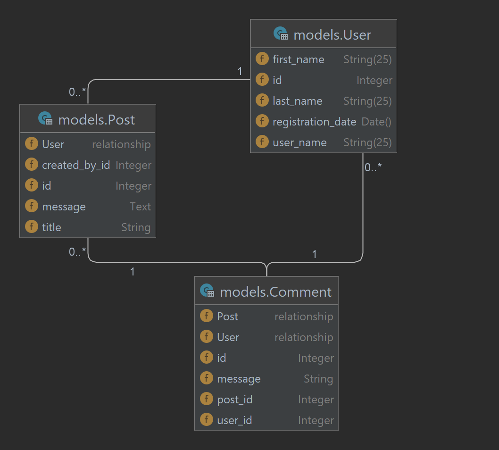
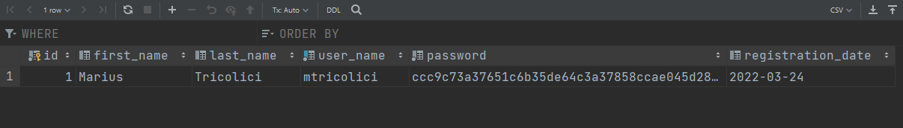

# ORMs

ORM, Object Relational Mapping is a technique in programming that attempts to represent data models that are saved in a
database, using Object.

This way, instead of rows, we have objects, instead of tables, we have classes.

Above all, ORMs map relationships between tables as attributes on the object.

So for example, if table called POSTS has a foreign key called created_by, you could access the user of that
relationship by simply accessing some_post.created_by attribute, without needing to query.

## Code first

Most ORMs provide us with a "Code first" approach to designing our data models. This way, we declare our classes, and
the ORM framework does the rest for us, that is creating the necessary tables for us to work with.

Alongside easing the table creation process, ORMs also help out during the querying process, as we will see later.

### Consider a use-case

Let's start with a use-case scenario. We want to make a simple system, where people can have user accounts, post
messages and comment.

For this, we will need 3 objects, to represent our data.

* User
* Post
* Comment

At the same time, we know that we would need to save this data, and the best place to save our data, is of course a
DataBase.

This means that we would need to create 3 Classes, and 3 Tables.

### The classes

````python
class User:
    id: int
    first_name: str
    last_name: str
    user_name: str
    password: str
    registration_date: str


class Post:
    id: int
    title: str
    message: str
    created_by: User


class Comment:
    id: int
    message: str
    post: Post
    user: User
````

### The database

If we were to create a program that should have the structure for the data defined above, we will end up with a set of
tables similar to this one


With foreign keys going from one table to the other, identifying the relationships between our data.

### Linking this information together

Now that we have our objects, and our tables, we would need to find an easy way to "link" the information from the
tables with the objects in our Python application.

Sounds like a lot of work, right ?

The answer is Yes, but Actually no.

What if we can use something that will make both our objects and our tables at the same time ?

This is what an ORM Does. It is the process of Mapping (linking) objects and their data to the appropriate Objects
inside a program.



The above diagram shows our classes and the interaction between them.

The lines between the classes indicate the relationship between the tables.

A User can have 0 to * (unlimited) posts. A Post can have 1 user.

A Post can have 0 to * (unlimited) comments. A Comment can have 1 post.

A Comment can have 1 user. A user can have 0 to * (unlimited) comments.

## Defining our classes

In order to define a class in our ORM, we should first define our Base.

In SQLAlchemy, we can get our base from a SQLAlchemy function.

```python
from sqlalchemy import create_engine
from sqlalchemy.orm import declarative_base

engine = create_engine('sqlite:///orm_database.db')
Base = declarative_base(engine)
```

Let's save our code above, in a separate file. Call it `database.py`.

Now onto our objects.

Let's make a new file, called `models.py`. Models, for "Data models".

This will contain both our Classes, and our tables at the same time.

### Users

Let's start with our first data object. User

````python
from datetime import datetime

from sqlalchemy import Column, Integer, String, Date, Text

from database import Base


class User(Base):  # We extend the Base class
    __tablename__ = 'user'

    id = Column(Integer, primary_key=True, autoincrement=True)
    first_name = Column(String(25))
    last_name = Column(String(25))
    user_name = Column(String(25), unique=True, nullable=False)
    password = Column(Text, nullable=False)
    registration_date = Column(Date(), default=datetime.now)


Base.metadata.create_all()  # Create the tables in our databases, after we declared them
````

Above, we can see that we declared a class. This class must include the Base class, the one we declared as
the `declarative_base`, that we imported from our `database.py` file.

Our Class works both as a simple class, and as a database object.

````python
my_user = User(
    user_name='mtricolici',
    first_name='Marius',
    last_name='Tricolici',
    password='pass'
)
print(my_user.user_name)
# mtricolici
print(my_user.first_name)
# Marius
print(my_user.password)
# pass
````

We can also, add the usual methods to our class. Let's add a password validation and a password setter.

````python
import hashlib


class User(Base):  # We extend the Base class
    __tablename__ = 'user'

    id = Column(Integer, primary_key=True, autoincrement=True)
    first_name = Column(String(25))
    last_name = Column(String(25))
    user_name = Column(String(25), unique=True, nullable=False)
    password = Column(Text, nullable=False)
    registration_date = Column(Date(), default=datetime.now)

    def __repr__(self):
        return f"User: [{self.user_name}, {self.first_name} {self.last_name}, {self.registration_date}]"

    def __str__(self):
        return repr(self)

    def set_password(self, password: str):
        self.password = self.hash_password_text(password)

    @classmethod
    def hash_password_text(cls, password):
        return hashlib.sha224(password.encode()).hexdigest()
````

Now, our passwords are stored securely in our database.

The hashilb library allows us to "hash" a value. Hashing is a process in which we take a value (for example our
password), and we generate a new, seemingly random value out of it. The process is not reversible. Meaning you can make
a hash from a text, but can't make a text out of a hash. Thus, someone who has access to your password hash, can't
actually know your password.

Hashes **always** result in the same **output** for the same **input**, that's how we can validate a password. The
smallest difference in the value of the text, will produce entirely different hashes. See example below.

````python
my_user = User(
    user_name='mtricolici',
    first_name='Marius',
    last_name='Tricolici'
)
my_user.set_password('pass')
print(my_user.user_name)
# mtricolici
print(my_user.first_name)
# Marius
print(my_user.password)
# ccc9c73a37651c6b35de64c3a37858ccae045d285f57fffb409d251d
print(my_user.hash_password_text('pass'))
# ccc9c73a37651c6b35de64c3a37858ccae045d285f57fffb409d251d
print(my_user.hash_password_text('pasS'))
# d2bbd5c94105f8b8a6688da15ddaa65667247de50ac8f3eef914fc4c
````

## Storing data, and working with the database

Now that our user class is complete, we can work with out database.

Storing data is easy, but first, we need to declare a **session**. Similar to our **Base**, our **Session** will be an
object that SQLAlchemy will generate, and that will allow us to work with our database objects.

The **Session** object is similar to the connection object we learned about last lesson. It is the object that does the
connection to the actual database and executes the queries.

In our `database.py` file, we will add a new line for our session.

````python
from sqlalchemy import create_engine
from sqlalchemy.orm import declarative_base, sessionmaker

engine = create_engine('sqlite:///ord_database.db')

Base = declarative_base(engine)
Session = sessionmaker(bind=engine)
````

Now, in a separate file we can use the session to work with our database.

File: `user_service.py`

```python
from database import Session
from models import User


def create_user(username, firstname, last_name, password):
    my_user = User(
        user_name=username,
        first_name=firstname,
        last_name=last_name
    )
    my_user.set_password(password)
    print(my_user)
    session = Session()  # Create new session
    session.add(my_user)  # Add user to the session
    session.commit()  # Save changes to the database
    return my_user


# Testing
if __name__ == '__main__':
    create_user('mtricolici', 'Marius', 'Tricolici', 'pass')
    # User: [mtricolici, Marius Tricolici, None]
```

The function above will add a user to the database, we can improve this function to take arguments form user input

We can see the changes in our database:



In case the user already exists, as usually we will receive an
error: `sqlalchemy.exc.IntegrityError: (sqlite3.IntegrityError) UNIQUE constraint failed: user.user_name`.

We can handle this error to nicely say that User already exists.

```python
from sqlalchemy.exc import IntegrityError

# Testing
if __name__ == '__main__':
    try:
        create_user('mtricolici', 'Marius', 'Tricolici', 'pass')
    except IntegrityError as ex:
        print('User already exists')
    # User: [mtricolici, Marius Tricolici, None]
```

## Querying data

Querying data is done by using our sessions Query method, and is pretty simple.

````python
def user_queries():
    session = Session()
    all_users = session.query(User).all()
    print(all_users)
    # [User: [mtricolici, Marius Tricolici, 2022-03-24]]
    users_count = session.query(User).count()
    print(users_count)
    # 1
    my_user = session.query(User).filter(User.user_name == 'mtricolici').one()
    print(my_user)
    # User: [mtricolici, Marius Tricolici, 2022-03-24]
````

As we can see above, instead of returning tuples, or random results, the Session automatically creates an object from
our query results. We can process this object as any other object.

Let's make a login feature.

````python
def login_user(username, password):
    session = Session()
    try:
        user = session.query(User).filter(User.user_name == username).one()
    except NoResultFound:  # Exception if .one() is applied to empty result
        raise Exception("User does not exist")
    # Validating password matches
    if not user.password == user.hash_password_text(password):
        raise Exception("Password incorrect")
    return user  # Success
````

The **filter** method for our query works the same way as a **where** method on the basic tables. But instead of columns
form our tables, we pass our object properties.

We can still have multiple filters, and use AND and OR operations.

Now we can test our login function, the following way.

```python
if __name__ == '__main__':
    user = login_user('mtricolici', 'pass')
    print(user)
    # User: [mtricolici, Marius Tricolici, 2022-03-24]
```

If we provide the wrong password or username, we will get an error.

```python
if __name__ == '__main__':
    user = login_user('mtricolici', 'notcorrect')
    # Exception: Password incorrect
    print(user)
```

You can read more about it [here](https://docs.sqlalchemy.org/en/14/orm/loading_objects.html)

## Relationships

As we have set out in the beginning, we wanted to add some more tables, Posts and Comments.

Let's work on declaring them, and explaining how object relationships work in an ORM.

I've added these declarations to the same `models.py` file.

```python

from sqlalchemy import Column, Integer, String, Text, ForeignKey
from sqlalchemy.orm import relationship

from database import Base


class Post(Base):
    __tablename__ = 'post'

    id = Column(Integer, primary_key=True, autoincrement=True)
    title = Column(String)
    message = Column(Text)
    created_by_id = Column(Integer, ForeignKey('user.id'))
    created_by = relationship("User", backref='posts')


class Comment(Base):
    __tablename__ = 'comment'

    id = Column(Integer, primary_key=True, autoincrement=True)
    message = Column(String, nullable=False)
    post_id = Column(Integer, ForeignKey('post.id'))
    user_id = Column(Integer, ForeignKey('user.id'))
    post = relationship("Post", backref="comments")
    user = relationship("User", backref="comments")
```

As you can see above, the definition of the main fields themselves is pretty easy. One part that's a needs explaining is
why we have both a **ForeignKey** and a **relationship**.

The **ForeignKey** links these objects on a database level. We use it to declare that the column matches a key in
another table.

The additional relationship is what the ORM will use to populate our "related" objects.

This way, we can access the Post of the comment, and the User of the comment from the Comment object itself.

Let's look at an example, first, let's create some data.

File: `post_service.py`

````python
from models import Post
from database import Session


def create_post(title, message, user):
    session = Session()
    post = Post(title=title, message=message, created_by_id=user.id)
    session.add(post)
    session.commit()
````

We can test this function like so:

```python
if __name__ == '__main__':
    user = user_service.login_user('mtricolici', 'pass')
    create_post('Hey', 'My first message', user)
    create_post('Second Title', 'Second message', user)
    create_post('Day 3', 'Example day 3', user)
```

Now, let's see the real power of an ORM.

Let's add a `__str__` method on our Post object.

````python
class Post(Base):
    __tablename__ = 'post'

    id = Column(Integer, primary_key=True, autoincrement=True)
    title = Column(String)
    message = Column(Text)
    created_by_id = Column(Integer, ForeignKey('user.id'))
    created_by = relationship("User", backref='posts')

    def __str__(self):
        return f"Post(created_by={self.created_by.user_name}, title={self.title}, message={self.message})"
````

We see that the `__str__` method above uses the created_by property as an user object. The ORM actually automatically
fills it in with the proper Object. Which is great.

We can list all posts like so:

```python
def list_posts():
    session = Session()
    return session.query(Post).all()


if __name__ == '__main__':
    for a in list_posts():
        print(a)
    # Post(created_by=mtricolici, title=Hey, message=My first message)
    # Post(created_by=mtricolici, title=Second Title, message=Second message)
    # Post(created_by=mtricolici, title=Day 3, message=Example day 3)
```

In our Post query we never even mentioned our user object, the ORM did it all by itself.

The same can be done in reverse.

```python
def list_posts_for_user(user_id):
    session = Session()
    user = session.query(User).filter(User.id == user_id).one()
    return user.posts


if __name__ == '__main__':
    for a in list_posts_for_user(1):
        print(a)
# Post(created_by=mtricolici, title=Hey, message=My first message)
# Post(created_by=mtricolici, title=Second Title, message=Second message)
# Post(created_by=mtricolici, title=Day 3, message=Example day 3)
```

We can access the posts of a user by accessing the posts from the user.

You may have noticed, but this was actually defined by us in the **relationship** definition.

```python
created_by = relationship("User", backref='posts')
```

The backref argument refers to "How will the user table access the post elements".

We can also add elements to the posts of the user, to the ORM will automatically save it to the user.

```python
def create_post_by_user(user_id):
    session = Session()
    user = session.query(User).filter(User.id == user_id).one()
    # We don't specify created_by_id
    new_post = Post(title='Adding extra post', message='Post message')
    user.posts.append(new_post)  # Adding post to the user
    session.commit()  # Don't forget to commit the session
```

Testing this will result in the following:

```python
if __name__ == '__main__':
    create_post_by_user(user_id=1)
    for a in list_posts_for_user(1):
        print(a)
    # Post(created_by=mtricolici, title=Hey, message=My first message)
    # Post(created_by=mtricolici, title=Second Title, message=Second message)
    # Post(created_by=mtricolici, title=Day 3, message=Example day 3)
    # Post(created_by=mtricolici, title=Adding extra post, message=Post message)
```

## Deleting items

We can delete objects, and thus, delete database records, using our sessions' **delete** method.

```python
session = Session()
elements = session.query(Post).all()
first = elements[0]
session.delete(first)
```

We can also perform a delete on a query. In that way, we delete all the elements that have resulted from the query

````python
from database import Session
from models import Post

session = Session()
session.query(Post).filter(Post.title.like('%test%')).delete(synchronize_session=False)
# Deletion is automatically persisted in the database
````

## Session object

The session object is actually very smart.

Besides, giving us the ability to interact with the database, it keeps track of all of our changes.

For example, it keeps the list of all modified objects that we changed since we queried.

````python
from database import Session
from models import User

session = Session()
user = session.query(User).filter(User.id == 1).one()
user.first_name = 'New name'
print(session.dirty)
# IdentitySet([User: [mtricolici, New name Tricolici, 2022-03-24]])
print(session.new)
# IdentitySet([])
new_user = User(user_name='some_new_user')
new_user.set_password('pass')
session.add(new_user)
print(session.new)
# IdentitySet([User: [some_new_user, None None, None]])
new_user.first_name = 'Updated name'
print(session.new)
# IdentitySet([User: [some_new_user, Updated name None, None]])
````

**dirty** refers to the objects that have changes that are not yet registered in the database.

**new** refers to the items that were created in the session, but not yet added to the database.

If at some point in our session we want to remove all changes, all we have to do is do a **session.rollback()**, and all
the changes will be ignored, and removed form the session.

Continuing the example above:

```python
session.rollback()
print(session.dirty)
# IdentitySet([])
print(user.first_name)
# Marius
print(session.new)
# IdentitySet([])
```

All the data has been restored to it's previous state, before we started modifying it.

Read more [here](https://docs.sqlalchemy.org/en/14/orm/session.html)
