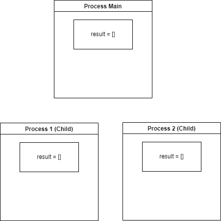
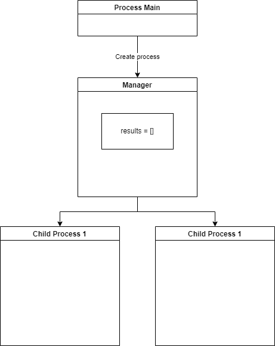
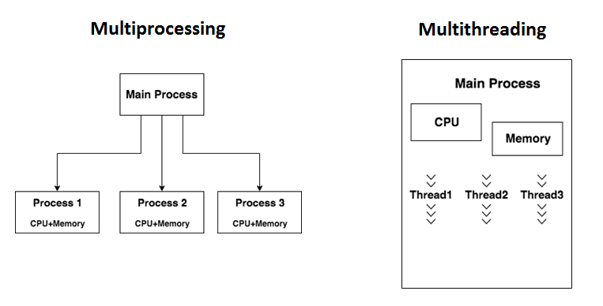

# Multiprocessing and asynchronous execution

Multiprocessing is the ability to divide our program into multiple separate processes. It provides us with the
possibility to execute our code asynchronously.

To understand asynchronous execution, we must first understand what is synchronous execution.

In a synchronous environment, a program execution follows a set of operations sequentially. The execution flow will
start processing a step and wait for it to return a result before proceeding to the next one.

With asynchronous programming, we can use the wait time required by the operation to process and return a result to
continue processing other tasks. This means that we can execute something else while we wait, instead of wasting all the
time on waiting.

When doing processing in a program, there are typically two types of tasks: CPU Bound and IO Bound

## CPU Bound vs IO Bound tasks


### CPU Bound

A process or a task is considered CPU Bound, if it spends all (or most) of its time calculating. For example, adding and
removing elements from lists, making calculations on many numbers, etc... .

CPU Bound tasks usually involve only working with data that's in the program memory (RAM) and most of the time "
crunching numbers".

CPU Bound also means, that if the CPU would be faster (or we would have more CPU), the task will run faster.

### IO Bound

In perspective, IO Bound loads are tasks and processes that spend most of its time waiting for something to load,
outside a programs' control. For example, waiting for a file to be read (from a hard disk to RAM), or waiting for an API
request to process, from an external service.

In case of IO Bound loads, increasing the number of CPU-s or the % of CPU that we use will not guarantee us an increase
in performance. That's because no matter how much CPU power we have, we will still need to wait for our resource from a
source that we have no control over.

### Summary

CPU Bound applications and task run faster the more processing power you have, IO Bound application don't always scale
with processing power, because they depend on an external (uncontrolled) source.

## Multiprocessing

Multiprocessing refers to the ability of a system to support more than one processor at the same time. Applications in a
multiprocessing system are broken to smaller routines that run independently. The operating system allocates these
threads to the processors improving performance of the system.

Consider a computer system with a single processor. If it is assigned several processes at the same time, it will have
to interrupt each task and switch briefly to another, to keep all of the processes going.

This situation is just like a chef working in a kitchen alone. He has to do several tasks like baking, stirring,
kneading dough, etc.

So the gist is that: The more tasks you must do at once, the more difficult it gets to keep track of them all, and
keeping the timing right becomes more of a challenge. This is where the concept of multiprocessing arises!

A multiprocessing system can have:

multiprocessor, i.e. a computer with more than one central processor. multi-core processor, i.e. a single computing
component with two or more independent actual processing units (called “cores”). Here, the CPU can easily executes
several tasks at once, with each task using its own processor.

It is just like the chef in last situation being assisted by his assistants. Now, they can divide the tasks among
themselves and chef doesn’t need to switch between his tasks.

## How python processes generally work

When you execute a python file, a Python process is started.

This process will work with only one of your logical processes. So if for example you have a CPU with 8 cores, your
python application will only use 1 of the cores, thus only 12.5% of your computer processors potential.

We can see this using a simple python program.

````python
a = 0
while True:
    a = a + 1
````

If we run this example, we will see that the CPU Usage is around 12.5% if you have 8 core CPU, it may be a bit higher,
but never even close to 100%.

This means that sometimes we just don't take full advantage off the CPU power we have.

This is where multiprocessing comes in.

### The concept

Multiprocessing allows us to create "**child**" processes, that run in the background. So we can declare a function,
that is going to be run in a separate proces from our "main" process.

This allows us to (for example): do something in our main process, and do something else in a different process.

## Multiprocessing in python

Multiprocessing in python is the ability to create multiple processes that run for the same application. This comes with
a lot of conceptual problems, for example, if both processes want to work with the same resource, or (for example)
update or read the same file, many issue arise.

So using multiple processes is usually done to fulfill different needs. The problem comes from our limited ability to
share resources between multiple processes. Each process has its own memory space inside the computer, and to the
computer OS, each individual process will act as a separate program. And programs don't like sharing their memory with
other programs.

### Some code

Multiprocessing in python is done using the **multiprocessing** module.

Let's say we want to calculate a very large list of prime numbers, from 0 to 3 million. This is an example of a process
that requires a lot of processing power, and the more of it we can use at the same time, the better.

In the example below, we will have 2 examples, one using multiprocessing and one using a single process.

We will benchmark each process, to see which one is faster.

````python
import multiprocessing
import time


def is_prime(n):
    if n == 2 or n == 3: return True
    if n < 2 or n % 2 == 0: return False
    if n < 9: return True
    if n % 3 == 0: return False
    r = int(n ** 0.5)
    # since all primes > 3 are of the form 6n ± 1
    # start with f=5 (which is prime)
    # and test f, f+2 for being prime
    # then loop by 6.
    f = 5
    while f <= r:
        if n % f == 0: return False
        if n % (f + 2) == 0: return False
        f += 6
    return True


def count_prime(from_nr, to_nr):
    prime_nrs = []
    for a in range(from_nr, to_nr):
        if is_prime(a):
            prime_nrs.append(a)
    print(f'Process from {from_nr} to {to_nr} finished')


def main_single():
    start_time = time.time()
    count_prime(0, 3000000)
    print('Elapsed for single', time.time() - start_time)


def main_multiple():
    start_time = time.time()
    process_to_100000 = multiprocessing.Process(target=count_prime, args=(0, 1000000))
    process_from_100000 = multiprocessing.Process(target=count_prime, args=(1000000, 2000000))
    process_from_200000 = multiprocessing.Process(target=count_prime, args=(2000000, 3000000))

    process_to_100000.start()
    process_from_100000.start()
    process_from_200000.start()

    process_to_100000.join()
    process_from_100000.join()
    process_from_200000.join()
    print('Elapsed for multiprocess', time.time() - start_time)


if __name__ == '__main__':
    main_single()
    main_multiple()
````

Output of the following example will be something similar to this:

```
Process from 0 to 3000000 finished
Elapsed for single 7.393322467803955
Process from 0 to 1000000 finished
Process from 1000000 to 2000000 finished
Process from 2000000 to 3000000 finished
Elapsed for multiprocess 3.6214654445648193
```

As we can see, the multiprocess approach took a lot faster. This is because we were using more of our computer power to
calculate those prime number at the same time, instead of limiting our program to just a part of our processing power.

### Why multiprocessing is hard

As I said before, processes don't like **sharing** resources along them. For this reason, we can't have regular objects,
and values passed to a child process as an argument, and expect them to be modified properly.

If we have 3 processes, that all try to work for the same result, they will have a hard time sharing the data, and
combining the result.

```python
import os
from multiprocessing import Process


def add_items(f, t, to_list):
    for a in range(f, t):
        to_list.append(a)
    print(f"From child {os.getpid()} {to_list}")


def main():
    results = []
    p1 = Process(target=add_items, args=(0, 10, results))
    p2 = Process(target=add_items, args=(10, 20, results))

    p1.start()
    p2.start()

    p1.join()
    p2.join()
    print(f"From main {os.getpid()} {results}")


if __name__ == '__main__':
    main()
```

Above we send a list as an argument, and wait for our process to fill in the list with elements from its calculations.

We use the `os.getpid()` function to get the process ID of the process where the code is running.

If we look at the output, we see the following situations.

```
Output:
From child 1812 [0, 1, 2, 3, 4, 5, 6, 7, 8, 9]
From child 2004 [10, 11, 12, 13, 14, 15, 16, 17, 18, 19]
From main 3896 []
```

What happened? Each process has its own version of the result. That's because they have not been instructed to share
that list across the processes.

This way, each process has its own memory space, and its own version of that "results" list.



Operating systems and programming language has generally taken this into consideration, and have allowed us to share
memory spaces, which would allow us to access that memory from multiple processes.

Let's rework our previous example to use shared memory to store our information in a common list.

````python
import os
from multiprocessing import Process, Manager


def add_items(f, t, to_list):
    for a in range(f, t):
        to_list.append(a)
    print(f"From child {os.getpid()} {to_list}")


def main():
    with Manager() as manager:
        # Creating a list inside our shared storage
        results = manager.list()
        # Creating processes
        p1 = Process(target=add_items, args=(0, 10, results))
        p2 = Process(target=add_items, args=(10, 20, results))
        # Starting processes
        p1.start()
        p2.start()
        # Waiting for processes to finish
        p1.join()
        p2.join()
        print(f"From main {os.getpid()} {results}")


if __name__ == '__main__':
    main()
````

We have declared a multiprocess manager. A manager object returned by Manager() controls a server process which holds
Python objects and allows other processes to manipulate them using proxies.

This server process will be the place where data that needs to be shared between multiple **child** processes is stored.

We can create sharable objects by calling the manager, in our case we created a list using the `manager.list()` method.

The output of the above example will be:

```
From child 18592 [0, 1, 2, 3, 4, 5, 6, 7, 8, 9]
From child 11788 [0, 1, 2, 3, 4, 5, 6, 7, 8, 9, 10, 11, 12, 13, 14, 15, 16, 17, 18, 19]
From main 14696 [0, 1, 2, 3, 4, 5, 6, 7, 8, 9, 10, 11, 12, 13, 14, 15, 16, 17, 18, 19]
```

Now all of our processes use a "shared" memory space, to access and add data.



However, when we use shared memory spaces like this, only one process can write or read data at a time, this means that
our child processes will be waiting for each other a lot, thus introducing performance problems. A good example of this
can be seen with our Prime Example.

````python
import multiprocessing
import time


def is_prime(n):
    if n == 2 or n == 3: return True
    if n < 2 or n % 2 == 0: return False
    if n < 9: return True
    if n % 3 == 0: return False
    r = int(n ** 0.5)
    # since all primes > 3 are of the form 6n ± 1
    # start with f=5 (which is prime)
    # and test f, f+2 for being prime
    # then loop by 6.
    f = 5
    while f <= r:
        if n % f == 0: return False
        if n % (f + 2) == 0: return False
        f += 6
    return True


def count_prime(from_nr, to_nr, storage):
    for a in range(from_nr, to_nr):
        if is_prime(a):
            storage.append(a)
    print(f'Process from {from_nr} to {to_nr} finished')


def main_multiple():
    with multiprocessing.Manager() as manager:
        start_time = time.time()
        list_of_prime = manager.list()
        # Creating the processes
        process_to_100000 = multiprocessing.Process(target=count_prime, args=(0, 1000000, list_of_prime))
        process_from_100000 = multiprocessing.Process(target=count_prime, args=(1000000, 2000000, list_of_prime))
        process_from_200000 = multiprocessing.Process(target=count_prime, args=(2000000, 3000000, list_of_prime))
        # Starting each process
        process_to_100000.start()
        process_from_100000.start()
        process_from_200000.start()
        # waiting for each process to finish
        process_to_100000.join()
        process_from_100000.join()
        process_from_200000.join()
        print(len(list_of_prime))
        print('Elapsed for multiprocess', time.time() - start_time)


if __name__ == '__main__':
    main_multiple()
````

Output:

````
Process from 0 to 1000000 finished
Process from 1000000 to 2000000 finished
Process from 2000000 to 3000000 finished
216816
Elapsed for multiprocess 10.317201375961304
````

As we can see, it's a lot slower than the previous example, that didn't use any lists to store the results.

This is because when trying to write to the list, each process is waiting a bit for the other process writing to the
same list at the same time. Multiple processes can't write to the same space in memory at the same time, they have to
wait until another process finishes.

This in terms means that we don't get any performance benefits from using multiprocessing, as it becomes now slower than
using just one process.

One way we could improve this, is by changing our `count_prime` function.

We can change it so that it stores its result in a local variable, then merges it with the **shared list** (the storage
variable).

````python
def count_prime(from_nr, to_nr, storage):
    tmp_storage = []
    for a in range(from_nr, to_nr):
        if is_prime(a):
            tmp_storage.append(a)
    storage.extend(tmp_storage)
    print(f'Process from {from_nr} to {to_nr} finished')
````

New Output:

````
Process from 0 to 1000000 finished
Process from 1000000 to 2000000 finished
Process from 2000000 to 3000000 finished
216816
Elapsed for multiprocess 3.84224534034729
````

As we can see, this is now significantly faster than, this is because we reduce the amount of writes to the **shared
list**, and thus, we reduce the time the processes have to wait for each other to write to that list.

### Communicating between processes

It is relatively easy to create a communication between to processes. This is done using a pipe. Pipes can be created by
our multiprocessing Manager, and can be used to send and receive information from and to processes.

Below we have a simple example:

````python

import multiprocessing


def sender(conn, msgs):
    """
    function to send messages to other end of pipe
    """
    for msg in msgs:
        conn.send(msg)
        print("Sent the message: {}".format(msg))
    conn.close()


def receiver(conn):
    """
    function to print the messages received from other
    end of pipe
    """
    while 1:
        msg = conn.recv()
        if msg == "END":
            break
        print("Received the message: {}".format(msg))


if __name__ == "__main__":
    # messages to be sent
    msgs = ["hello", "hey", "hru?", "END"]

    # creating a pipe
    parent_conn, child_conn = multiprocessing.Pipe()

    # creating new processes
    p1 = multiprocessing.Process(target=sender, args=(parent_conn, msgs))
    p2 = multiprocessing.Process(target=receiver, args=(child_conn,))

    # running processes
    p1.start()
    p2.start()

    # wait until processes finish
    p1.join()
    p2.join()
````

## Multi threading

Multi-threading, similar to multiprocessing, allows us to run code side by side. The way multithreading differs, is that
all **threads** are part of one process.

Multi-threading allows us to perform asynchronous programming. That is, python will try to work on multiple tasks
simultaneously.

This has both advantages, and disadvantages.

The advantages, are that both of our threads run in the same process, and in essence have access to the same variables.



Consider the following example:

````python
import threading


def threaded_append(data_list, num):
    data_list.append(num)


if __name__ == "__main__":
    # creating thread
    my_list = []
    t1 = threading.Thread(target=threaded_append, args=(my_list, 1))
    t2 = threading.Thread(target=threaded_append, args=(my_list, 2))

    print(my_list)
    # starting thread 1
    t1.start()
    # starting thread 2
    t2.start()

    # wait until thread 1 is completely executed
    t1.join()
    # wait until thread 2 is completely executed
    t2.join()
    print(my_list)
    # both threads completely executed
    print("Done!")
````

The output of this example will be:

```
[]
[1, 2]
Done!
```

We can see above that both threads managed to add information to the same list without problems. This is great, right ?

Let's go back to our prime numbers examples, and try to see how well multithreading execution performs.

````python
import threading
import time


def is_prime(n):
    if n == 2 or n == 3: return True
    if n < 2 or n % 2 == 0: return False
    if n < 9: return True
    if n % 3 == 0: return False
    r = int(n ** 0.5)
    # since all primes > 3 are of the form 6n ± 1
    # start with f=5 (which is prime)
    # and test f, f+2 for being prime
    # then loop by 6.
    f = 5
    while f <= r:
        if n % f == 0: return False
        if n % (f + 2) == 0: return False
        f += 6
    return True


def count_prime(from_nr, to_nr, storage):
    tmp_storage = []
    for a in range(from_nr, to_nr):
        if is_prime(a):
            tmp_storage.append(a)
    storage.extend(tmp_storage)
    print(f'Process from {from_nr} to {to_nr} finished')


def main_single():
    start_time = time.time()
    list_of_prime = list()
    count_prime(0, 3000000, list_of_prime)
    print(len(list_of_prime))
    print('Elapsed for single', time.time() - start_time)


def main_multiple():
    start_time = time.time()
    list_of_prime = list()
    thread_to_100000 = threading.Thread(target=count_prime, args=(0, 1000000, list_of_prime))
    thread_from_100000 = threading.Thread(target=count_prime, args=(1000000, 2000000, list_of_prime))
    thread_from_200000 = threading.Thread(target=count_prime, args=(2000000, 3000000, list_of_prime))

    thread_to_100000.start()
    thread_from_100000.start()
    thread_from_200000.start()

    thread_to_100000.join()
    thread_from_100000.join()
    thread_from_200000.join()
    print(len(list_of_prime))
    print('Elapsed for multithread', time.time() - start_time)


if __name__ == '__main__':
    main_single()
    main_multiple()
````

Output:

```
Process from 0 to 3000000 finished
216816
Elapsed for single 7.181816339492798
Process from 0 to 1000000 finished
Process from 2000000 to 3000000 finished
Process from 1000000 to 2000000 finished
216816
Elapsed for multithread 6.620961904525757
```

As we can see, although our multi-threaded approach is a bit faster, it's not as fast as our multiprocess approach (that
took around 3.6 seconds), and it's closer to our single process approach.

This is because, all the threads are inside our main process, so they are still limited by our process limitations,
mainly that it can use only a part of our processor at a time.

### Why is it slow

Our code is still CPU-bound, and having multiple threads still means we can not go over the process CPU usage limit. And
in this scenario, because all of our threads actively perform calculations, the process gives each thread a bit of time
to process, before switching to another thread, and continuing it there.

### When multithreading is great

As we had seen, the multithreaded approach isn't much faster when doing CPU Bound tasks, but it shines when performing
some IO Bound tasks.

That's because, during the wait time, while a thread is idle, the process will try to work on something else (other
threads).

We can illustrate this with a simple example:

Let's say we will have a "wait" time of 1 second for a process, and we want to start multiple of those processes. If we
do it sequentially, in a single thread, we will have to wait 5 total seconds.

If we do multiple threads for the processes, then each thread will be waiting during that 1 second together.

````python
import threading
import time


def print_after_1_second():
    time.sleep(1)
    print('After 1 second')


def main_single():
    start_time = time.time()
    for a in range(5):
        print_after_1_second()
    print('Elapsed for single', time.time() - start_time)


def main_multiple():
    start_time = time.time()

    threads = []
    for a in range(5):
        threads.append(threading.Thread(target=print_after_1_second))

    for thread in threads:
        thread.start()
    for thread in threads:
        thread.join()
    print('Elapsed for multithreaded', time.time() - start_time)


if __name__ == '__main__':
    main_single()
    main_multiple()
````

```
Output:

After 1 second
After 1 second
After 1 second
After 1 second
After 1 second
Elapsed for single 5.0273637771606445
After 1 second
After 1 secondAfter 1 second
After 1 secondAfter 1 second


Elapsed for multithreaded 1.0070078372955322
```

As we can see from the results, the processing took significantly less time, as all the threads were "sleeping" at the
same time. So we only waited for a total of 1 seconds.

You can also see, that our print output is somewhat incorrect. This is because the threads encountered a so-called
**race conditions**.

Because all the threads were trying to write to the console at the same time, some part of the output from one thread
was being written while another thread was also trying to write, and the new line after each line was being added out of
sync.

We can combat this behaviour with a **lock**.

The **lock** will tell the threading executor that the thread that acquired the lock is currently working with some IO
Operation, in our case writing to the console. Telling all the other threads to "wait" for it to release the lock,
before they can do the same.

````python
import threading
import time


def print_after_1_second(lock=None):
    time.sleep(1)
    try:
        if lock:
            lock.acquire()
        print('After 1 second')
    finally:
        if lock:
            lock.release()


def main_single():
    start_time = time.time()
    for a in range(5):
        print_after_1_second()
    print('Elapsed for single', time.time() - start_time)


def main_multiple():
    start_time = time.time()

    threads = []
    lock = threading.Lock()
    for a in range(5):
        threads.append(threading.Thread(target=print_after_1_second, args=(lock,)))

    for thread in threads:
        thread.start()
    for thread in threads:
        thread.join()
    print('Elapsed for multithreaded', time.time() - start_time)


if __name__ == '__main__':
    main_single()
    main_multiple()
````

Now our output looks a lot better

```
After 1 second
After 1 second
After 1 second
After 1 second
After 1 second
Elapsed for single 5.0297956466674805
After 1 second
After 1 second
After 1 second
After 1 second
After 1 second
Elapsed for multithreaded 1.0182979106903076
```

### Practical example

Similar to our example with multiple process communication, we can have a thread wait for information to be passed to
it.

````python
import queue
import threading
import time


def process_queue(queue_to_process):
    while True:
        next_in_queue = queue_to_process.get()
        if next_in_queue == 'stop':
            break
        print('From queue', next_in_queue)
        time.sleep(0.1)


def main():
    my_queue = queue.Queue()
    thread = threading.Thread(target=process_queue, args=(my_queue,))
    thread.start()
    for a in range(1, 10):
        my_queue.put(input('Queue item:'))
    my_queue.put('stop')
    thread.join()


main()
````

In this example, we use a queue. If the queue has items, our thread will process (print) the item. If it has no items,
it will wait for an item to be available in the queue.

Another practical example, is processing multiple requests, in this way, we can wait less.

````python

import threading
import time

import requests


def process_request(url, responses):
    response = requests.get(url)
    responses.append(response)


def process_single_thread(urls):
    start = time.time()
    responses = []
    for url in urls:
        responses.append(requests.get(url))
    print(responses)
    print(f'Single took {time.time() - start}')


def process_multi_thread(urls):
    start = time.time()
    responses = []
    threads = []
    for url in urls:
        threads.append(threading.Thread(target=process_request, args=(url, responses)))
    for thread in threads:
        thread.start()
    for thread in threads:
        thread.join()
    print(responses)
    print(f'Multi-thread took {time.time() - start}')


def main():
    urls = [
        'http://www.example.com',
        'http://www.google.com',
        'http://www.yahoo.com',
        'http://www.stackoverflow.com/',
        'http://www.reddit.com/'
    ]
    process_single_thread(urls)
    process_multi_thread(urls)


main()
````

Output:

```
[<Response [200]>, <Response [200]>, <Response [200]>, <Response [200]>, <Response [200]>]
Single took 14.309030532836914
[<Response [200]>, <Response [200]>, <Response [200]>, <Response [200]>, <Response [200]>]
Multi-thread took 2.3850724697113037
```

## Usages

Usages of multiprocessing and multithreading vary.

Most commonly they are used when you need multiple processes/threads with different responsibilities.

Think about a WEB Server. It needs to check for new connection very often, and when a new connection is established, it
needs to **both** check for more new connections, and fulfill the request from the previous connection.

If a WEB Server used a single process (or thread), it would mean that it could fulfill only a single request at a time.

We can also use Multiprocessing to split distinct workloads between processes. For example, one process draws the GUI of
our application, and another process makes the processing for our application. This way, when there is a long or
complicated process running in our application (like loading something from a server), our user can still use the
application, while the data is being loaded from another process.

