# Setting up github

### First, navigate to your PyCharm Settings

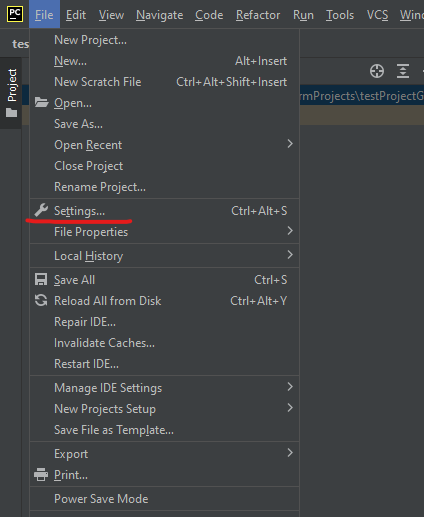

### Search and open GitHub settings

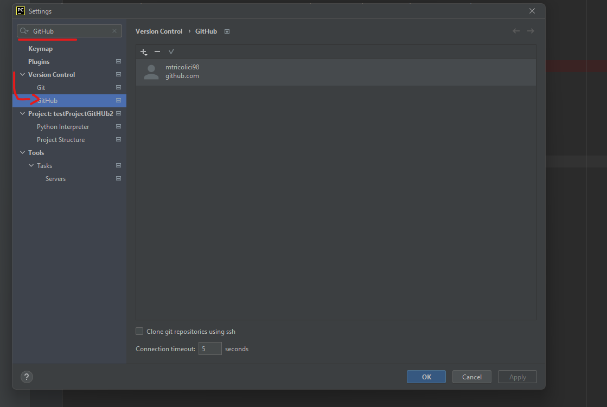

If you dont see your account in the list of accounts, don't worry, add your account using the + button

### Add your account if you havent done so already

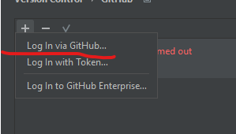

After a successful login, click **Apply** or **Ok** to save the settings.

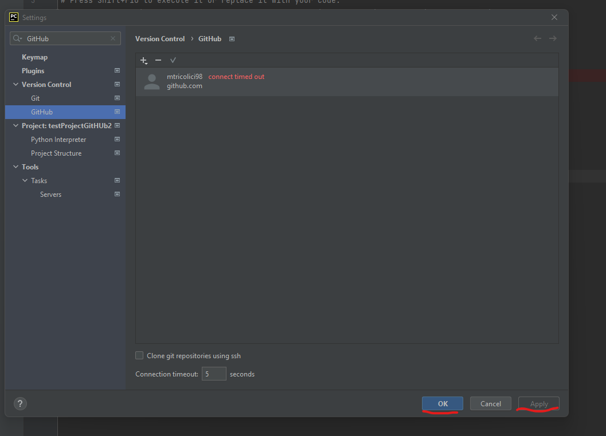

### Share project on GitHub

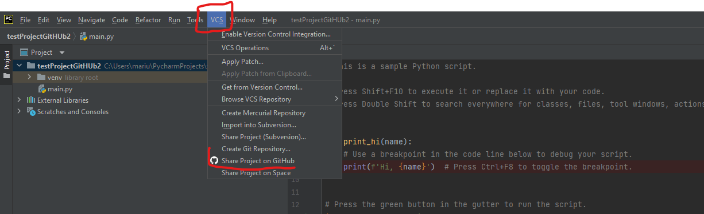

Select the VSC top bar menu, and find the **Share project on GitHub** option.

This will open a window that looks like the one below

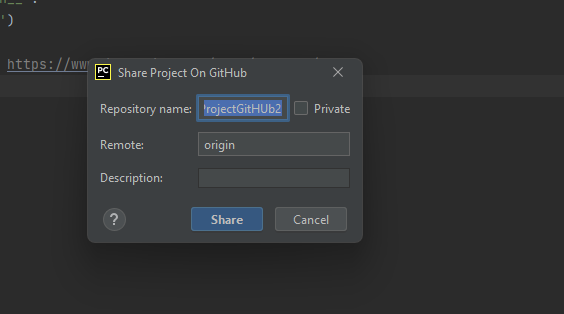

Click **Share**

### Select files to add

When (and if) prompted to select files to add, only check **main.py**, uncheck the **.idea** folder.

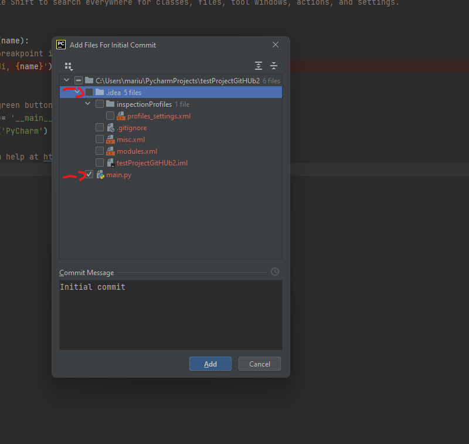

Then click **Add**.

You will see a success message like below.

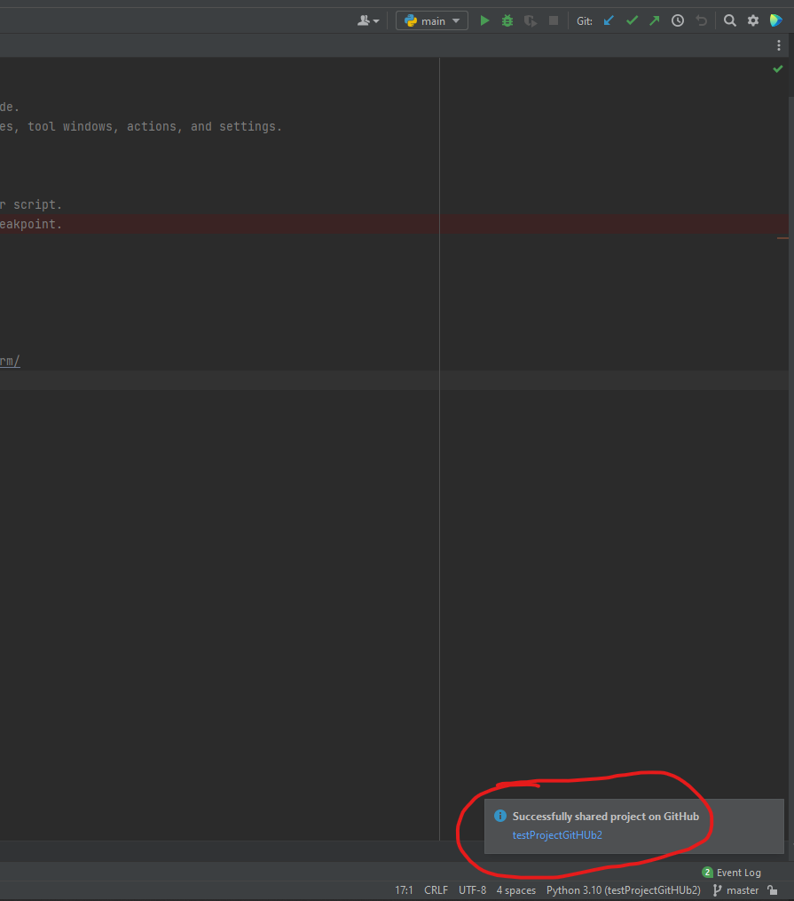

### Now your project is on github

## Adding files to git

In order for GIT to track your files, you must sometimes tell it what files to track.

You can either Add the file to GIT when after creating the file (see below)

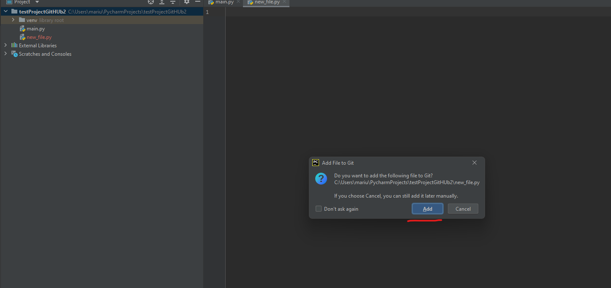

Or you can do so manually after you created or copied a file into the project (see below).

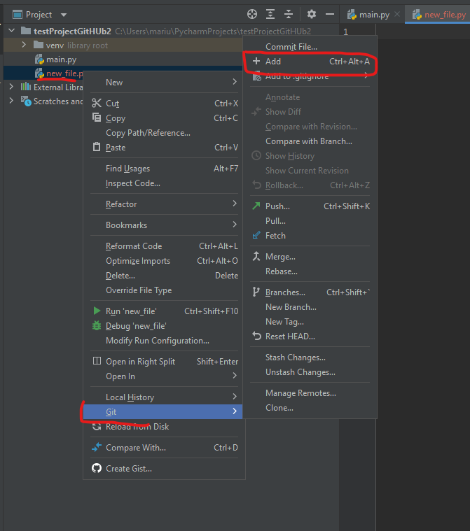.

## Saving changes

GIT Allows you to save changes made using a procedure called *Commit*

In order to Commit, press **Ctrl + K** or use the menu (see below)

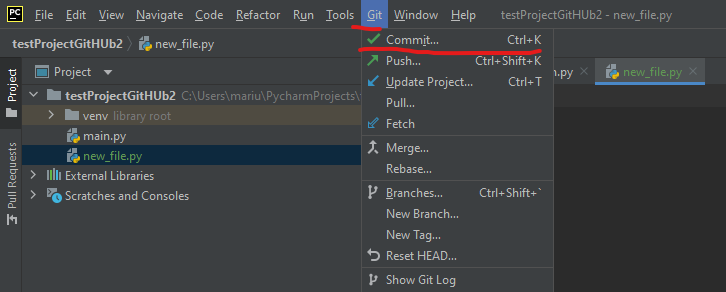

The commit window will appear. You should type in a message and press commit.

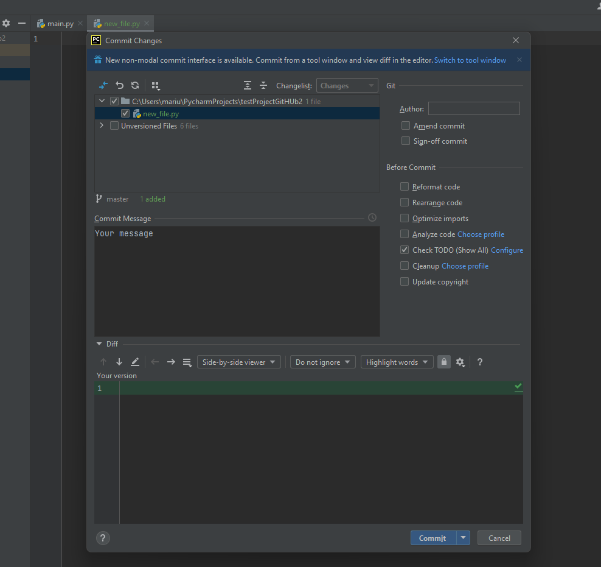

## Publishing your changes

In order to publish your changes to GitHub you should **Push** your changes.

You can do so using **Ctrl + Shift + K** or using the menu (see below)

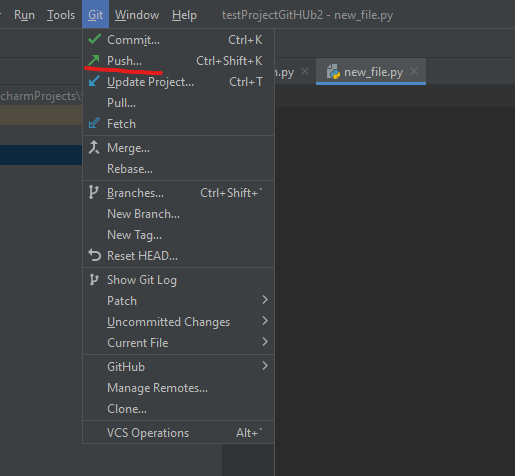

After you have pushed suceessfully your changes are saved remotely on github. 
