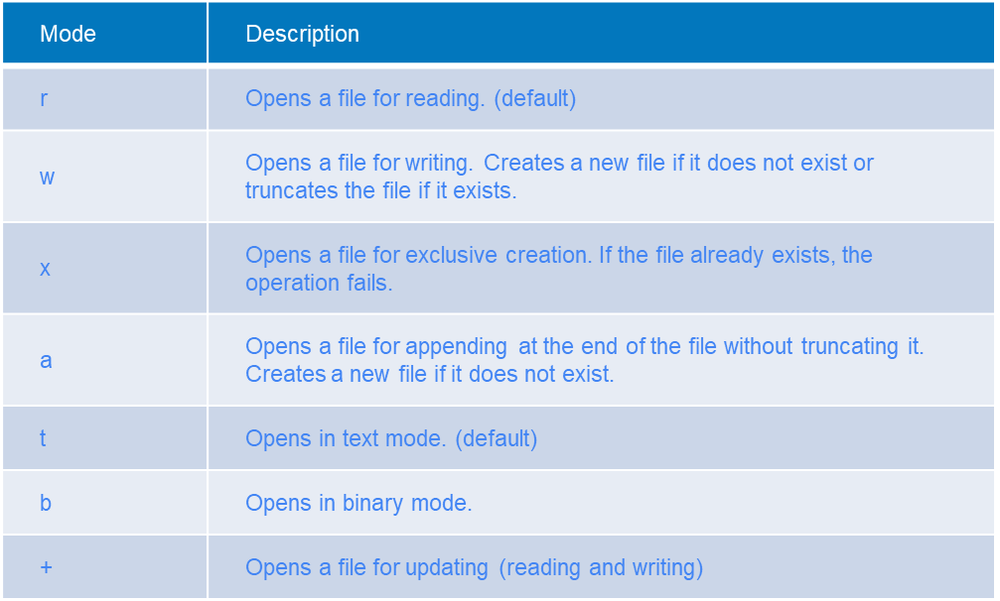

# Errors, Files

## What we've learned

We've learned about data types, collections and ways to work with them, functions and ways to build them.

Now is the time we learn on how to make our program, interface with our computer.

We will also discuss, how to handle unexpected errors, and how to make and handle expected errors.

## Exceptions (errors)

Exceptions are a part of a program that tell the user, the system and the program that something has gone wrong.

Exceptions are an essential part of a developers' toolkit, as it allows him to easily communicate that something
unexpected happened.

Exceptions are a way to communicate to other parts of the program that "Something happened that wasn't supposed to
happen"

But sometimes, we don't want Exceptions. Sometimes, we want to ignore them, or to ask the user to try again.

We could check everything everywhere with **if** statements to avoid having Exceptions, but that would be very
counter-productive. Instead, we can let Exceptions happen, and deal with them.

### Error handling

In python errors are handled using a **try: except:** block.

Try-Except blocks are similar to **if: else:** blocks

The code inside **try** will complete if there are no errors and the code inside **except** will execute only if there
is an error inside the **try** block

Example

```python
try:
    print('Some random String' + 120)
except:
    print('Error happened but I am still running')
```

### Excepting the expected

We can declare what kind of error we expect to happen, in order to handle that exact error

Example below.

```python
try:
    print(int(input('Input a number')))
except ValueError:
    print(f"User didnt input a valid number")
```

It's also possible to except any error. This is done by excepting **Exception**

````python
try:
    print(int(input('Input a number')))
except Exception:
    print(f"Something didnt go to plan")
````

### Finding out what the error was

You can use the **as** keyword to keep the instance of the error (exception) inside a variable.

To use **as** you **must** declare the type of the exception.

Most exception in python are derived from the **Exception** class. This means that if you try to except **Exception**,
you will most probably catch all of them.

```python
try:
    print('Some random String' + 120)
except Exception as error:
    print(f"Failed with error: {str(error)}")
```

### When is this useful ?

For example, you may need to use an external service, the quality or reliability of which you can never trust.

In that case, you may want to retry a couple of times, or use a fallback, or perhaps notify someone that something went
wrong.

Simple example: Assuring user inputs a float value

```python
def convert_to_float(string):
    try:
        return float(string)
    except ValueError:
        return None  # User input was not a float string


def main():
    maybe_number = None
    while maybe_number is None:
        maybe_number = convert_to_float(input('Input a numeric value'))
        if maybe_number is not None:
            print(f'Thanks for {maybe_number}')
        else:
            print(f'Try to input a number this time')


```

A more complex example: Trying to connect to an external service multiple times

```python
# This code is an example and is not functional
def get_connection_to_aws(max_retries):
    retries = 0
    connection = None
    while retries < max_retries:
        try:
            connection = connect_to_amazon_service(CONN_URL, CONN_KEY)  # Example Fucntion
            return connection
        except Exception as ex:
            print(f'Connection failed, reason: {str(ex)}')
            retries += 1
    if connection is None:
        send_mails_to_admin(str(ex))
```

### Avoid broad exceptions

The **except** statement allows the developer to specify what kind of exceptions the except block should handle.

This is usually more than just a suggestion. If the except statement is too broad, you may handle exception that were
never meant to be handled.

Not specifying an exception, will let the code run even if the exception is a system event. For example a keyboard
interrupt. Which should close any application.

```python
try:
    number = int(input('Enter A number'))
    result = 10 / number
except:  # VERY BAD Because we don't know what exactly failed
    pass  # Code
```

```python
try:
    number = int(input('Enter A number'))
    result = 10 / number
except ArithmeticError as err:  # Much better
    pass  # Code
```

Thankfully the IDE will warn you about the broad exceptions, but still, be on the lookout.

### Exceptions are only handled when encountered

This means that any code inside the **try** block will run until it encounters the error.

```python
try:
    print('Printing something')
    print('Printing something else')
    print(10 / 0)
    print('Printinng at the end')
except ZeroDivisionError:
    print('Exception handled')
# Printing something
# Printing something else
# Exception handled
```

The code in the try block will only run until it encounters the error

### Finally

Fundamentally, **try:except** blocks work similar to this.

```
# Run code 
if errror:
    # Run execept block
```

But they also provide a **finally** block. What is it for ?

````python
def convert_to_float():
    value = None
    try:
        value = float(input('Input a float'))
    except ValueError as ex:
        print(f"User invalid input: {str(ex)}")
    finally:
        return value
````

In the **finally** block, programmers usually do "clean-up". So they remove all that's left after either a successful or
a failed try:except execution.

Example:

```python
try:
    make_database_query(database, query)  # Trying to make a query against this database
except Exception as ex:
    print(f"Database had a problem: {str(ex)}")  # Database Failed to make query
finally:
    close_database_connection(database)  # Close connection to database, even if the query failed
```

### Raising Exceptions

Raising (or creating) an exception can be done using the **raise** keyword, and allows us to create errors anywhere in
our code.

All exceptions have a standard body that can contain the message.

```python
def find_index(list_to_lookup, item_to_find):
    for index in range(len(list_to_lookup)):
        if list_to_lookup[index] == item_to_find:
            return index
    raise Exception('Item not found')


try:
    find_index([1, 2, 3], 4)
except Exception as ex:
    print(str(ex))  # Ooops, Something went wrong...
```

### Types of exceptions.

All exceptions extend **BaseException**. So if you try to except BaseExecution, you will _catch them all_.

This is never a good thing, but nonetheless. You are also capable of extending and making your own exceptions.

But it is recommended to extend **Exception**.

```python
class MyCustomException(Exception):
    pass  # We don't need a body
```

### Raising Custom exceptions

```python
class ItemNotFoundError(Exception):
    pass  # We don't need a body


def find_index(list_to_lookup, item_to_find):
    for index in range(len(list_to_lookup)):
        if list_to_lookup[index] == item_to_find:
            return index
    raise ItemNotFoundError('Item not found')


try:
    find_index([1, 2, 3], 4)
except ItemNotFoundError as ex:
    print(f'Item was not found')
```

### Catching multiple exceptions

You can catch multiple exceptions, not just one, and it can be done in two ways, grouping them in one **except** block,
or having one separate **except** block for each.

```python
try:
    a = int(input('a'))
    b = int(input('b'))
    print(a / b)
except ZeroDivisionError as ex:
    print('Didn\'t you go to school')
except ArithmeticError as ex:
    print('Thoose numbers don\'t make sense')
except ValueError as ex:
    print("One of the values provided is not a number")
except Exception as ex:
    print("I don't know what happened, but I know it's bad...")
```

The **above** example will execute a specific except block, based on the type of the exception that was raised.

```python
try:
    a = int(input('a'))
    b = int(input('b'))
    print(a / b)
except (ZeroDivisionError, ArithmeticError) as ex:
    print('Thoose numbers don\'t make sense')
except Exception as ex:
    print("I don't know what happened, but I know it's bad...")
```

You can also provide a tuple of Exception classes, that one except block will catch.

#### Note: The order of exception matters, same as with elif blocks.

# Files

Working with files is always tricky. Today we will learn the basics on how to work with them.

### Creating a file

In order to open a file, we can use the **open** function in python.

Open is a built-in function to used to work with files. It allows to create/read/change files.

I order to open a file, we need to specify two arguments. The file name (or path) and the open mode.

The available modes are as follows:

```
'r'	Open a file for reading. (default)
'w'	Open a file for writing. Creates a new file if it does not exist or truncates the file if it exists.
'x'	Open a file for exclusive creation. If the file already exists, the operation fails.
'a'	Open for appending at the end of the file without truncating it. Creates a new file if it does not exist.
't'	Open in text mode. (default)
'b'	Open in binary mode.
'+'	Open a file for updating (reading and writing)
```

```python
file = open('new_file.txt', 'w')
file.write('Hey i\'m writing to a file')
file.close()
file = open('new_file.txt', 'r')
data = file.readline()
file.close()
print(f"Data from the file: {data}")
```

It is important to close the file after opening it, as not closing it will not save the data, and may cause other
issues.

### Using with

The **with** keyword provides a **context manager**. Not a lot of functions have a context manager, but when they do,
context managers handle the initialization and finalization of an object or process.

For example, the **open** context manager will handle closing the file when the program exits the **with** block.

```python
with open('new_file.txt', 'w') as file:
    file.write('Some text')
```

Now we don't need to worry about closing the file, as the context manager will do this by itself.

We will study context managers more in-depth a bit later. But they are very useful when you know what you are doing.

### w vs wb

There are two main ways we open a file, text mode or byte mode.

Text mode (**w** or **wt**, **at**), as we've seen allows us to write strings to the file.

Byte mode (**wb**, **ab**) allows us to write binary data. This is useful when we're working with non-text data, like
.docx, .pdf, .xlsx, .jpeg files.

### All modes



### Reading and writing

If you try to specify the open mode as **rw** it will fail with an error. In order to allow both reading and writing to
the same file you can use the +. So the open mode should be like 'r+' or 'w+'.

If the file doesn't exist 'w+' will create the file but 'r+' will raise an Exception

```python
file = open('new_file.txt', 'w+')
print(file.writable())  # True
print(file.readable())  # True
```

If you want to read data in a file after it was written, you should reset the **cursor** inside the file

This is done using the seek method of the file

When writing to a file, the cursor shifts to the end of what was written. You may need to manually "adjust" the cursor
sometimes.

```python
file = open('new_file.txt', 'w+')
file.write('HeyHey')
file.seek(0)
data = file.read()
print(data)
file.close()
```

#### Append mode

Opening a file in append mode only allows adding to the file. It will not overwrite existing data.

```python
file = open('new_file.txt', 'a+')
file.write('HeyHey')
file.seek(0)
data = file.read()
print(data)
file.close()
```

# JSON

JSON is a data-interchange format that is easily human and computer readable.

In its structure, JSON data Strongly Resembles a python **dict**. This is why it's pretty easy to work with json files
in python.

JSON is a very versatile format. It allows us to store all base data types (string, int, float, boolean) but also some
less simle ones (dicts and lists).

Example JSON

````json
{
  "some_numbers": [
    1,
    2,
    3,
    4
  ],
  "a_number": 24.5,
  "a_boolean": true,
  "some_sting": "Hey i'm a string",
  "a dict inside the json file": {
    "name": "I am a dict"
  }
}
````

You can see that the JSON above looks oddly familiar, that's because the structure is similar to that one of a dict in
python.

In JSON you can store a dict, or a list of dicts, or a list of elements, or simply an element.

Storing one value in json examples

```json
10
```

```json
"I am a string inside JSON"
```

```json
false
```

Storing a list of values in JSON

```json
[
  "List",
  "of",
  "strings"
]
```

```json
[
  10.2,
  10.3,
  10.4
]
```

Storing a dict in JSON

```json
{
  "value": 100
}
```

Storing a list of dicts in JSON

```json
[
  {
    "name": "Marius"
  },
  {
    "name": "John"
  }
]
```

## Creating JSON in python

We can use the built-in json module to convert data types from and to JSON.

```python
import json

my_dict = {
    'name': "Marius",
    'username': "pythonguru1337",
    'password': "never_user_plaintext_password",
    'user_group': {'name': 'Admin', 'permissions': '__all__'},
}
json_string = json.dumps(my_dict)  # Creates a json string from my_dict
print(my_dict)
print(json_string)
```

If we run the code above, we will notice that the structure of our str dict representation and our JSON is the same.

```python
import json

list_of_users = [{
    'name': "Marius",
    'username': "pythonguru1337",
    'password': "never_user_plaintext_password",
    'user_group': {'name': 'Admin', 'permissions': '__all__'},
}, {
    'name': "Admin",
    'username': "administrator",
    'password': "admin",
    'user_group': {'name': 'Admin', 'permissions': '__all__'},
}]

json_string = json.dumps(list_of_users)  # Creates a json string from my_dict
print(list_of_users)
print(json_string)
```

### What can we JSON-ify

Everything that can be represented in base data types alone (so: strings, numbers, bools, lists, dicts)

Complex objects, can also be represented as JSON, but they need to go through the process of **Serialization**.

Serialization is where we define how to "break down" our custom or complex data type into more basic ones (usually still
a dict).

### Limitations of JSON

You are not allowed to have other JSON objects as keys, so basically, keys can only be strings or numbers. This is not a
critical limitation, it's just something to keep in mind when converting to JSON.

## Converting back from JSON

We can as easily convert from JSON as we do to JSON. The resulting object from a json conversion is always either a dict
or a list of dicts.

To convert JSON text to a python object use the **json.loads()** function.

````python
import json

my_dict = {'name': 'Marius'}
json_string = json.dumps(my_dict)  # Create json from dict
print(json_string)
new_my_dict = json.loads(json_string)  # Create dict from json
print(new_my_dict)
````

Similarly, a list will work just as well.

````python
import json

my_list = [1, 2, 3, 4, 5]
json_string = json.dumps(my_list)
print(json_string)
new_list = json.loads(json_string)
print(new_list)
````

### Why use JSON ?

JSON allows us to store information in textual form, that makes it easy for us (the developers) to work with data in an
accessible way.

## Example

Let's create a program that stores users and registers users in a file.

````python
import hashlib
import json


def register_users(nr_of_users):
    user_list = []
    for t in range(nr_of_users):
        username = input('Input username')
        password = input('Input password')
        password = hashlib.md5(password.encode()).hexdigest()  # Hashing password (never store plaintext password)
        user_list.append(
            {
                'username': username,
                'password': str(password)
            }
        )
    return user_list


def save_users_to_file(user_list):
    existing_users = dict()
    try:
        with open('users.json', 'r') as usr_file:
            users_in_file = json.loads(usr_file.read())
            for user in users_in_file:
                existing_users[user['username']] = user  # Getting all users from the file
    except FileNotFoundError:
        pass
    except json.JSONDecodeError:
        pass
    for user in user_list:
        if user['username'] in existing_users:
            print(f'User {user["username"]} will be overridden')
        existing_users[user['username']] = user
    with open('users.json', 'w') as usr_file:
        usr_json = json.dumps(list(existing_users.values()))
        usr_file.write(usr_json)


def list_users_from_file():
    try:
        with open('users.json', 'r') as usr_file:
            users_in_file = json.loads(usr_file.read())
            for user in users_in_file:
                print(user)
    except FileNotFoundError as ex:
        print('No users yet')
    except Exception as ex:
        print(str(ex))


def add_users():
    nr_of_user = int(input('How many users you want to add ? '))
    users = register_users(nr_of_user)
    save_users_to_file(users)


def main():
    while True:
        print('\nSelect what you want to do ?')
        print('1 To list all users')
        print('2 To add users')
        print('3 To exit')
        ex_map = {
            1: list_users_from_file,
            2: add_users,
            3: exit
        }
        choice = int(input('Choice ?: '))
        print('\n')
        ex_map[choice]()


if __name__ == '__main__':
    main()

````
