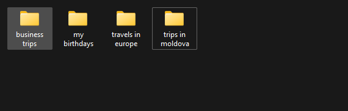

# Lesson 9 - Short recap and mode

## Variables

### Declaring variables

Variables are declared by assigning a value to a reference (variable name)

```python
im_a_string_variable = 'I am the value of the variable'
im_a_boolean_variable = True
im_a_int_variable = 10
im_a_float_variable = 10.5
```

### Multiple Assignment

In python, it is possible to define multiple variables on the same line (if they have the same value)

```python
# We are initializing 3 different variables with the same value
sum = total = avg = 0
```

If we use a mutable type (ex: list or dict) all 3 variables will have the same reference

```python
list_1 = also_list_1 = list()
list_1.append(1)
print(also_list_1)  # [1]
```

### Assigning different values on same line

It is also possible to assign different values by "unpacking" these values immediately

Consider the example below. On one line we define both the list and the dict

```python
my_list, my_dict = list(), dict()
print(my_list)  # []
print(my_dict)  # {}
```

````python
a = 10
b = 5

addition, subtraction = a + b, a - b
````

This process still provides readable code, but does not waste any "lines of code"

## Types

We already know that all values in python have a type.

We are already familiar with types such as str, int, float, bool, list, dict.

But how do we find the type of a value inside our programs ?

The function **type** helps us identify the type of variable or value.

Example:

```python
print(type('my string'))
# <class 'str'>
```

The above example prints the type of a string value. We can see that the printed value is of **class** str.

### The class

An easy way to understand what a class is, is to think of it as "classification". All values in python have a **class**.

The class of the value is the same as what we use for the constructor we use for them.

Examples

```python
int_class = int
list_class = list
string_class = str
bool_class = bool

my_int = int_class('10')  # 10 - same as int('10')
my_list = list_class([1, 2, 3])  # [1, 2, 3] - same as list([1,2,3])
my_bool = bool_class('i have value')  # True - same as bool('i have a value')
```

### More examples

We can use it to compare our value to our class.

```python
print(type('my string') == str)
# True
print(type(120) == str)
# False
print(type(120) == int)
# True
print(type([1, 2, 3]) == list)
# True
```

### When is this useful ?

Let's say you have a function, that needs to make some calculation. That function should require an integer. But we can
allow the function to also take float and string. Then we handle the value based on the type it is, and if the type is
not what we expect. We can raise a custom error.

```python

def my_calculation_function(numeric_value):
    if type(numeric_value) != int:  # If our value is not an int we need to convert it
        if type(numeric_value) == float:  # Try to convert from float
            numeric_value = int(numeric_value)
        elif type(numeric_value) == str:  # Try to convert from string
            numeric_value = int(numeric_value)
        else:  # We cant convert any other type to int
            raise TypeError(
                f'Unexpected value type, expected int, float or numeric string, but got {type(numeric_value)}')
    return 2 ** numeric_value  # We do the calculation


print(my_calculation_function(1))
# 2
print(my_calculation_function('1'))
# 2
print(my_calculation_function(1.4))
# 2
print(my_calculation_function([1, 2, 3]))
# TypeError: Unexpected value type, expected int, float or numeric string, but got <class 'list'>
```

Another example: A function that gets the max value from a collection.

````python
def get_max_from_collection(collection):
    if type(collection) == dict:
        return max(collection.values())
    elif type(collection) == list or type(collection) == set or type(collection) == tuple:
        return max(collection)
    else:
        raise TypeError('Unsupported type for operation')


print(get_max_from_collection([2, 4, 10]))
# 10
print(get_max_from_collection({1, 2, 34, 4, 4, 5}))
# 34
print(get_max_from_collection({'one': 1, 'ten': 10, 'twenty': 20}))
# 20
````

## Useful builtins

### sum

Sum is built-in function that allows us to perform addition on a collection of numeric values (by default) or of any
other type of element that supports addition (except string), by providing the start argument.

The elements inside a sum function can be any type that can be added.

```python
# List of numbers
print(sum([1, 2, 3, 4]))
# 10
# List of numbers
# Providing the value to start with
print(sum([1, 2, 3, 4], 10))
# 20
# List of lists
# Providing the start argument as an empty list, so that other values can be added to the initial value
print(sum([['1'], ['2']], []))
# 123
```

### max

Max is a builtin function that allows us to quickly get the highest value in a collection.

Arguments of max can either be a collection directly (except dict) or each element as a separate argument.

```python
# Highest value in a list of numbers
print(max([1, 2, 4, 10]))
# 10
# Highest value in a list of arguments
print(max(1, 2, 3, 4))
# 4
```

### min

Min is the opposite of max.

Min is a builtin function that allows us to quickly get the lowest value in a collection.

Arguments of min can either be a collection directly (except dict) or each element as a separate argument.

```python
# Lowest value in a list of numbers
print(min([1, 2, 4, 10]))
# 1
# Lowest value in a list of arguments
print(min(1, 2, 3, 4))
# 1
```

### sorted

Sorted is a built-in function that sorts the items in a collection, and returns a list of sorted items

```python

my_list = [1, 5, 7, 4, 10, 2, 20]

print(sorted(my_list))
# [1, 2, 4, 5, 7, 10, 20]

print(sorted(my_list, reverse=True))
# [20, 10, 7, 5, 4, 2, 1]
```

## For and While loops

I hope we all already know our loops.

You can have a **for** loop or a **while** loop.

The **for** loop will repeat a sequence of code for each item in a collection. And a **while** loop will execute an
instruction while the condition is **True**.

We also know about **break**. Which is a way for us to stop the loop.

I want to introduce to you 2 new concepts.

### Continue

The first one is called **continue**

Continue allows us to **continue** to the next step in the iteration.

Consider the following example:

```python
a = 0
while a < 5:
    a += 1
    print('Before if')
    if a % 2 == 0:
        continue  # Skips to the beginning of the loop
    print('After if')

# Before if
# After if
# Before if
# Before if
# After if
# Before if
# Before if
# After if
```

We can see from the output of our print statements, that when **continue** was used (inside the if statement) we
continued reset to the begining of the loop.

All code until continue will be executed. All code after continue will not be executed.

Let me show you a more practical example.

````python
# Calculating sum of even numbers until 20
a = 0
sum = 0
even_list = []
while a < 20:
    a += 1  # adding to our iteration count
    if a % 2 != 0:  # Number is not even, we don't want to execute any more in this iteration
        continue  # Skips to the beginning of the loop
    even_list.append(a)
    sum += a

print(even_list)
# [2, 4, 6, 8, 10, 12, 14, 16, 18, 20]
print(sum)
# 110
````

### Continue with for loops

Similarly, continue can be used with **for** loops.

```python
sum = 0
even_list = []
for a in range(1, 21):
    if a % 2 != 0:  # Number is not even, we don't want to execute any more in this iteration
        continue  # Skips to the beginning of the loop
    even_list.append(a)
    sum += a

print(even_list)
# [2, 4, 6, 8, 10, 12, 14, 16, 18, 20]
print(sum)
# 110
```

**continue** works the same way for both **for** and **while** loops.

### Else for loops

Else is also a valid statement for while and for loops.

The syntax is as follows

```python
for a in range(100):
    pass
else:
    print('No breaks in the loop')

a = 0
while a < 100:
    a += 1
else:
    print('No breaks in the loop')
```

As you probably have already guessed, the **else** block for a loop is only triggered when no **break** statements have
been activated inside the loop.

```python
def print_if_found(my_list, to_find):
    for a in my_list:
        if a == to_find:
            print(f'Found {to_find}')
            break
    else:
        print('Not found')


print_if_found([1, 2, 3], 3)
# Found 3
print_if_found([1, 2, 3], 4)
# Not found
```

The same example can be done with a while loop:

```python
def print_if_found(my_list, to_find):
    a = 0
    while a < len(my_list):
        if my_list[a] == to_find:
            print(f'Found {to_find}')
            break
        a += 1  # Incrementing a
    else:
        print('Not found')


print_if_found([1, 2, 3], 3)
# Found 3
print_if_found([1, 2, 3], 4)
# Not found

```

## More working with functions

### Returning Multiple Values

Python allows us to return multiple values at the same time. For example, let consider a max_min function.

A function that will take a list, calculate the maximum number in the list, the minimum number in the list and return
both.

When returning multiple values, python actually returns a Tuple.

It is **important** to note that if at least one **return** returns multiple values, it is recommended that all should.

```python
def max_min(list_of_numbers):
    max = None
    min = None
    for number in list_of_numbers:
        if not max:
            max = number
        if not min:
            min = number
        if number > max:
            max = number
        if number < min:
            min = number
    return min, max


min_val, max_val = max_min(list(range(10, 50)))
```

### Passing unlimited arguments to function

We've seen function that take any number of arguments inside their argument list.

Example: the print function.

```python
print(1, 2, 3, 4, 5, 6)  # I could go on forever but you get the point.
```

You have probably wondered how it's done. This is done by "packing" multiple values inside a variable.

### Unpacking

We've learned unpacking, this is the process of splitting a collection of values into individual variables.

````python
a, b = [1, 2]
print(a)  # 1
print(b)  # 2
````

### Packing

Packing is the reverse process, and it is done using the * (star/multiply) operator.

Packing is mostly done inside function definitions.

Results of the packing process are mostly always tuples

Example:

```python
def function_with_unlimited_args(*my_args):
    print(my_args)


function_with_unlimited_args(1, 2, 3)
# (1, 2, 3)
function_with_unlimited_args([1, 2, 3])
```

You can still use other arguments, but they have to be keyword arguments.

````python
def function_with_unlimited_args_2(*my_args, start_text_with=''):
    print(f'{start_text_with} {my_args}')


function_with_unlimited_args_2(1, 2, 3, 4, start_text_with='Start with this:')
# Start with this: (1, 2, 3, 4)
````

Packing is how many functions like print, max, min are implemented.

### Repacking

Packing can be used to re-pack part of a collection.

Remember unpacking. We discussed that you can unpack the same number of items as the number of values in a collection.

```python
first, second = (1, 2)
```

We can use packing to "re-pack" the remaining values.

```python
my_list = [1, 2, 3, 4, 5, 6, 7, 8]
first, second, *other = my_list
print(first)  # 1
print(second)  # 2
print(other)  # [3, 4, 5, 6, 7, 8]
```

Packing like this still works if you want to unpack 2 items and the list has only 2 items. But the collection should not
have less than you are trying to unpack.

```python
my_list = [1, 2]
first, second, *other = my_list
print(first)  # 1
print(second)  # 2
print(other)  # [] -- Empty list
```

You cannot use packing directly:

````python
*my_list = 1, 2, 3  # This does not work
````

## File names for .py files

How should a file name for python files be formatted.

It's important to have the names of our files formatted in a proper way.

Py files should follow the same format as a normal python variable.

It is not recommended to have spaces or special characters (except underscore **_** ) inside the file names.

Bad file names examples:

```
numbers(library).py -- Python won't recognize this
numbers library.py-- python won't recognize this either
numbers.library.py -- python won't recognize this as well
```

In the examples above, you can run these files, but you will not be able to import them as modules anywhere.

Good file names examples:

```
numbers_library.py -- good
NUMBERS_LIBRARY.py -- not optimal, but works
NumbersLibrary.py -- good
_numbers_library.py -- good
```

If your .py file names are not formatted properly you will not be able to import functions from them.

## Folder names for packages

The same logic as with the .py modules applies to packages (folders). If a package name is not formatted properly, the
package will not be importable, so be aware of that when making your files.

## Structuring your files

Structuring your files inside your project is very important.

Consider the following example.

You have a folder full of pictures, is it better to have just all the pictures in one folder ? Or is it better to have
individual folders for groups of images?


Structuring everything in the appropriate folders means that it will be way easier for you to find what you are looking
for.

It also means that when you have a new file, you will know exactly where to put it, so you can find it easily later.



Isn't the second option much better ? Now not only I know where to search a specific file, I also know where to add new
ones when I have more to add.

The same exact logic applies to programming.

