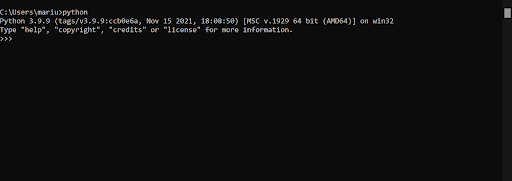
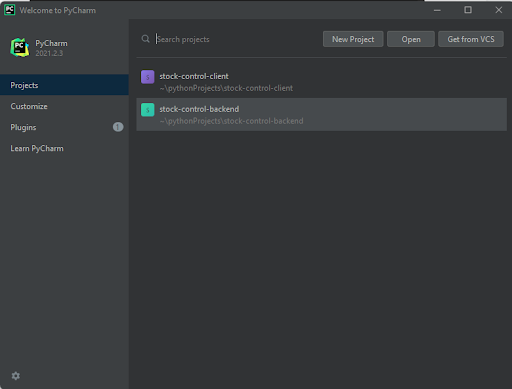

# Lesson One

## What you need to know about computers

### Computers aren&#39;t smart

All that computers do is execute instructions, and at it&#39;s fundamentals they are just advanced
&quot;calculators&quot;.

But they only work with ones and zeroes, that&#39;s where programming languages come in

### Computers execute instructions, that&#39;s what they excel at

Over the course of history, a lot of development has been made both to computer hardware (processors, memory) and the
software.

Although computers work only using ones and zeroes, those can be understood by the computer as a set of instructions.

The instructions your processors work with are mostly very basic, but programming languages provide a layer in between
the programmer and the processor, to make possible the development of complex algorithms and processes.

## What is programming

Some call it an art, others call it a science, but in general, programming is just the process of telling a computer how
to do things.

The basic principle of programming is describing each step of a solution to the computer so that the computer can then
do the calculations.

Consider the following example:

You want to add 2 numbers, **a** and **b**

You need to tell the computer that there should be an **a** with a value of let&#39;s say **10**.

You then also need to tell the computer that there should be a **b** with a value of **5**.

Following that you would need to tell the computer that there should be a value **sum** that should be equal to **a +
b**.

Programming is the process where you take this explanation, and you lay it out as code, in any given programming
language, then let the computer do the calculation for you.

An exapmle of "pesudocode" would look like this

````
a = 10
b = 5
sum = a + b
````

Although this example is fairly simple, it denotes the process of explaining every step of the calculation to the
computer, so that it can then do calculations by following those steps.

Of course that&#39;s not all that programming is about, but most of it is just an extension of the principle mentioned
above.

## What you need to know about python

### Why python

Easy to learn, easy to apply in practice.

Let&#39;s compare it to another popular language.

A simple Hello world program in Java

````java
public class HelloWorld {
    public static void main(String[] args) {
    System.out.println("Hello world");
    }
}
````

Same program in Python

````python
if __name__ == '__main__':
    print('Hello World')
````

As you can see, there are less steps to achieve the same result, which is the number one reason why people choose
python.

### Interpreted language

This means that python code is translated through the interpreter to machine code, instead of being compiled to a
program.

Why does it matter ? Because this means that any machine that has a compatible version of python will run python code,
no compilation needed.

### What is compilation

In short, compilation is the process of translating and optimizing programs to run on a machine natively. Examples of
compiled applications are your .EXE files some of you might be familiar with.

See more about compilation here: [https://youtu.be/QXjU9qTsYCc](https://youtu.be/QXjU9qTsYCc)

### Multiple versions

Python comes with multiple versions, the two big releases are Python2 and Python3. Although Python2 is becoming less
commonly used, some companies might have projects that run on that version. But if you learn python3, you&#39;ll be able
to use any Python version, and perhaps even any high-level programming language.

Or course, there aren&#39;t only 2 versions of python out there. Focusing on python3 we have a couple of mainstream
releases, python 3.5, 3.7, 3.9 and 3.10. Each of those increments offer performance improvements, along with some
builitin functionality to make the programmers life easier.

The same is true for almost any other programming language out there.

## Getting python to work

Install all of the following, PyCharm, Git, Python

[Links below](#links)

## What is git

Git is a Version Control System (VCS), and it&#39;s role is to allow single or multiple developers to collaborate
efficiently on large (or even small) projects. Each change made by each developer can be easily tracked and reverted if
needed. This allows us to react fast to breaking changes, review each other&#39;s code and work together efficiently to
build a better product.

## Trying out python

### The console (CLI)

The CLI (Command Line Interface) is an old but trusty way to interface (communicate) between the computer and the user.
It is the predecessor to the GUI (Graphical User Interface) and is by far the easiest way to get information to and from
a program (in mostly all programming languages). Get familiar with it, as you may need to use it a lot sometimes.

### Using the python interpreter

If you open your CMD (command line) and type in &quot;python&quot; or &quot;python3&quot; you will be greeted with a
screen similar to this one.



This CLI allows us to try out running code in python. If you have this, this means that python is successfully installed
on your computer.

You can type in &quot;print(&#39;Hello World&#39;)&quot; to ask the computer to type &quot;Hello world&quot;, easy,
right ?

## Starting with Pycharm

### What is an IDE

IDE stands for Integrated development environment. For most developers, this is the most important tool in their kit. An
IDE works a lot like a text editor, but has a lot of extra features that let the developer navigate, view and edit code
efficiently.

All IDE&#39;s support code highlighting, this way different parts of the syntax are colored in different ways, which
makes it easier to navigate and edit code.

Most IDE&#39;s come packed with various features, plugins and allow the user to install custom plugins, to make the
experience of coding even simpler or more efficient.

### Starting up PyCharm

At startup you will be greeted with a window that may look similar to this.



Click the _ **New Project** _ button.

In the new window, select _ **&quot;Pure python&quot;** _


Select _ **&quot;New Environment Using: Virtualenv&quot;.** _

Give your project a fitting name (you can also change the folder location if you want).

And click **Create.**

You can create as many projects as you want. One for each lesson, chapter, or even the whole course.

### What is the environment.

Although we will later go more in-depth with external modules and packages, it&#39;s worth knowing that the
environment (virtual environment) helps us (developers) have separate independent groups of packages (with it&#39;s own
python versions) for each of our projects. So that there may not be problems with the versions of packages or Python
itself.

This way, if I have a project that needs Python version 2.7 and version 1.0 of some library, I can make a virtual
environment that meets those needs, and if I simultaneously want to work on a different project that uses Python 3.7 and
some 2.0 version of that library, I can have another virtualenv. This way I have 2 environments each for its project,
without affecting the Global version of python on my computer.

Definition from python docs:

_A virtual environment is a Python environment such that the Python interpreter, libraries and scripts installed into it
are isolated from those installed in other virtual environments, and (by default) any libraries installed in a
&quot;system&quot; Python, i.e., one which is installed as part of your operating system._ (
source: [venv — Creation of virtual environments — Python 3.10.1 documentation](https://docs.python.org/3/library/venv.html))

Here we already see the benefit of using an IDE, as instead of using CMD commands to create a virtual environment,
Pycharm does it for us.

## Our first actual piece of code

````python
if __name__ == '__main__':
    name = input()
    hello_string = 'Hello,' + name
    print(hello_string)
````

Let&#39;s break down what happens here.

On the first line, we do three things.

1. Declare a variable called **name**
2. Assign the value of the input() function to the _ **name** _ variable (using the **=** sign).
3. Using the **input()** function, we ask the console to ask the user for input. The console will wait for the user to
   type in their name, and press the **Enter** key.

On the second line, we do two more things.

1. Take the value of our variable **name** that we previously received from the console and we combine it (using the **
   +** sign) to the _&#39;Hello, &#39;_ text.
2. And we assign it to the **hello\_string** variable.

On the third line, we do one more thing. We take the variable **hello\_string** and we pass it to the **print()**
function. This instructs the computer to output the value of **hello\_string** to the console.

#### A shorter version

````python
if __name__ == '__main__':
    name = input()
    print('Hello,' + name)
````

#### An even shorter version

````python
if __name__ == '__main__':
    print('Hello,' + input())
````

The shorter versions do the same exact thing, as far as the user is concerned. But as we can see, although they provide
the same result, they are coded differently.

All of those versions are processed by the computer exactly the same.

```
>? Marius
Hello,Marius
```

## Breaking down Python Syntax

Let&#39;s look back at the long version of our Hello program

```python
if __name__ == '__main__':
    name = input()
    hello_string = 'Hello,' + name
    print(hello_string)
```

Here we have a couple of processes that we make use for our first example:

- Variable declaration
- Function calls
- String concatenation (addition)

### Declaring variables in python

First is a variable declaration (_line 1_):

What is a variable?

A variable is a _reference_ to a value. It works the same way like my name is a reference to me. And it allows us to
have a _value_ assigned to a variable, so that we can use the reference at any later stage.

Variables in python are declared by giving it a **variable name.**

There are a couple of rules regarding variable names in python.

- Variable names must start with a letter or an underscore.
- Variable names should not contain spaces
- Variable names shouldn&#39;t start with special characters (except underscore)
- Variables should always be assigned a value when created.

```python
var_name = 'var'
VAR_NAME = 'var'
_var_name = 'var'
__var_name = 'var'
___var_name = 'var'
$var_name = 'not a var'
4var_name = 'not a var'
v4r_name = 'var'
```

As you can see in the picture above, we already see the benefits of using an IDE, as it is showing us multiple errors on
the lines where we make an illegal variable declaration.

As mentioned above, in order to declare a variable, we must assign a value to it.

We assign values to a variable by the use of the **= (equal)** sign.

It is also possible to assign variables to other variables, see below.

```python
some_variable = 'value'
other_variable = some_variable
print(other_variable)  # value
```

In the example above, both some_variable and other_variable have the same value.

### Function calls

We see two usages of function calls in the small program we&#39;ve made.

First is a call to the **input()** function, and the second is the **print()** function.

What is a function call?

A function call is the process, where we use another function (a small program) to do something.

To call a function, we should use parentheses **(** and **).** This tells the interpreter that we are
&quot;calling&quot; the function. If we just type **input** without the parentheses on our first line then the function
never gets executed.

Functions can take 0 to infinite parameters. For example, the **input()** function was called with no parameters, but
the **print()** function had the **hello\_string** parameter passed onto it.

You will learn more about parameters in a later lesson. But the main takeaway is that in order to execute a function, we
always must use the parentheses.

### Addition / String concatenation

The last process we used was Addition, between two strings.

Firstly, what is a string? A string is a group of characters, so basically, a string is just a different way of saying
text. In python, strings are declared by having text in between quotes ( **&#39;** ) or ( **&quot;** ). Both single and
double quotes work for that

It&#39;s no secret (hopefully) what the process of addition is, for numbers simple, 1 **+** 1 is 2. And in Python,
addition between strings works in a magical way, where it will combine the first string with the second string, creating
a new string in the process.

For example adding &#39;Hel&#39; + &#39;lo&#39; will result in &#39;Hello&#39;

## Links:

[Download PyCharm: Python IDE for Professional Developers by JetBrains](https://www.jetbrains.com/pycharm/download/)

[Git - Downloads (git-scm.com)](https://git-scm.com/downloads)

[Download Python | Python.org](https://www.python.org/downloads/)

## Refs:

[Compilers](https://youtu.be/QXjU9qTsYCc)

[GIT Short](https://youtu.be/2ReR1YJrNOM)
